# Governança Administrativa, RBAC, Trilha de Auditoria & Configurações do Provedor (ispERP)

> **Documento Oficial Consolidado**  
> **Status:** Aprovado / Em Implementação  
> **Versão:** 1.0  
> **Data:** 2026-09-05  

---

## 1. Visão Geral e Princípios Arquiteturais

O módulo de Administração do **ispERP** consolida o centro de controle, governança, segurança regulatória e parametrizações operacionais do Provedor de Serviços de Internet (ISP). Este documento unifica as especificações técnicas, modelos de dados, fluxos de auditoria forense e interfaces visuais do painel administrativo.

### Princípios Mandatórios:
1. **Segurança em Primeiro Lugar:** Toda ação crítica é rastreada, imutável e autenticada. Ações sensíveis (estornos, concessão de isenções, suspensões de usuários, trocas de perfil) exigem registro detalhado na trilha de auditoria (`audit_logs`).
2. **Identificadores Temporais UUIDv7:** Todos os novos registros utilizam UUIDv7 ordenado por tempo (`com.github.f4b6a3.uuid.UuidCreator`).
3. **Zero Dados Fictícios:** Interfaces consomem dados 100% reais de APIs REST. Empty states objetivos quando não houver dados.
4. **Tolerância Zero a Overflow:** Layout defensivo no Flutter com `SingleChildScrollView`, `Expanded`, `Flexible`, `Wrap` e `TextOverflow.ellipsis`.

---

## 2. Estrutura dos 4 Módulos do Administrador

```mermaid
graph TD
    Admin[Painel do Administrador] --> M1[1. Colaboradores & RBAC /admin/users]
    Admin --> M2[2. Trilha de Auditoria & Segurança /admin/audit-logs]
    Admin --> M3[3. Central de Configurações /admin/settings]
    Admin --> M4[4. Painel Executivo & DRE /admin]

    M1 --> M1_1[Listar / Filtrar Colaboradores]
    M1 --> M1_2[Cadastrar Novo Colaborador]
    M1 --> M1_3[Suspender / Reativar Acesso]
    M1 --> M1_4[Alterar Cargo / Role Canônica]
    M1 --> M1_5[Redefinir Senha Segura]

    M2 --> M2_1[Audit Trail Multi-Critério]
    M2 --> M2_2[Filtros: Colaborador, Período, Módulo]
    M2 --> M2_3[Drill-down de Detalhes JSONB]
    M2 --> M2_4[Alertas Anti-Fraude Sentinel Watchdog]

    M3 --> M3_1[Aba Comunicação: SMTP & WhatsApp QR Code]
    M3 --> M3_2[Aba Gateways & Financeiro: Xingubit Pay, Multas, Juros, Comodato]
    M3 --> M3_3[Aba Telecom & PPPoE: NAS FreeRADIUS, Régua Anatel, Planos]
    M3 --> M3_4[Aba Fiscal & Empresa: Dados Cadastrais, Certificado A1, NFCom 62]

    M4 --> M4_1[DRE por Competência e Caixa]
    M4 --> M4_2[Monitor de Sessões PPPoE Online]
    M4 --> M4_3[Saúde Óptica de OLTs e ONUs Críticas]
    M4 --> M4_4[Status de Backups & Disaster Recovery]
```



---

## 3. Módulo 1: Colaboradores & RBAC (`/admin/users`)

### 3.1. Papéis de Acesso ([`UserRole`](file:///Users/ruy/Code/ispERP/backend/src/main/java/br/dev/xb/isperp/entity/UserRole.java))
O sistema possui 11 perfis canônicos de controle de acesso:
- `ADMIN`: Acesso irrestrito a configurações, segurança, usuários e infraestrutura.
- `DIRECTOR`: Visualização executiva 360°, DRE e auditoria.
- `CFO`: Governança financeira global, aprovação de despesas e conciliação bancária.
- `FINANCIAL`: Operação diária de contas a pagar/receber, emissão de faturas e baixas.
- `ATTENDANT`: Atendimento ao cliente, abertura de chamados e emissão de 2ª via de faturas.
- `ADMINISTRATIVE_ASSISTANT`: Apoio operacional e cadastro básico de clientes.
- `SUPPORT_N2`: Suporte avançado de NOC, diagnóstico de OLTs, desbloqueio de portas e roteamento.
- `SUPPORT_ANALYST`: Triagem de suporte, testes de ping/latência e agendamento de visitas.
- `TECHNICIAN`: Painel de campo mobile, conclusão de O.S., auto-discovery de ONUs e custódia de materiais.
- `USER`: Usuário padrão do sistema.
- `CLIENT`: Assinante autenticado no Portal do Cliente / App do Assinante.

### 3.2. Endpoints e Contratos de Governança
- `GET /api/users`: Lista completa de colaboradores com filtros por cargo e status ativo/inativo.
- `GET /api/users/{id}`: Detalhes do colaborador.
- `POST /api/users`: Criação de novo colaborador com CPF validado, e-mail único e papel atribuído.
- `PUT /api/users/{id}`: Atualização de dados cadastrais e perfil.
- `PATCH /api/users/{id}/status?active={true|false}`: Suspensão ou reativação imediata do acesso.
- `POST /api/users/{id}/reset-password`: Redefinição de senha temporária ou envio de link seguro.
- `DELETE /api/users/{id}`: Inativação lógica com revogação de sessões ativas.

---

## 4. Módulo 2: Trilha de Auditoria Forense (`audit_logs`)

### 4.1. Estrutura do Banco de Dados
A tabela `audit_logs` no PostgreSQL (criada na migração Flyway `V3`):
```sql
CREATE TABLE audit_logs (
    id UUID PRIMARY KEY DEFAULT uuidv7(),
    user_id UUID,
    action VARCHAR(100) NOT NULL,
    entity_name VARCHAR(100) NOT NULL,
    entity_id VARCHAR(100),
    details JSONB,
    created_at TIMESTAMP WITHOUT TIME ZONE DEFAULT CURRENT_TIMESTAMP
);
CREATE INDEX idx_audit_logs_user_id ON audit_logs(user_id);
CREATE INDEX idx_audit_logs_created_at ON audit_logs(created_at);
```

### 4.2. Entidades e Ações Críticas Auditadas
1. **Módulo Financeiro & Lançamentos:**
   - `INVOICE_MANUAL_PAYMENT`: Baixa manual de fatura informando operador, valor, juros cobrados e justificativa.
   - `INVOICE_CANCELLED`: Cancelamento de cobrança ou título.
   - `FEE_WAIVED`: Concessão de isenção de taxa de instalação ou visita técnica de O.S.
   - `REFUND_ISSUED`: Estorno financeiro realizado.
   - `FINANCIAL_ENTRY_CREATED`: Lançamento manual de débito ou crédito na tesouraria.
2. **Módulo de Contratos & Telecom:**
   - `CONTRACT_ACTIVATED` / `CONTRACT_CANCELLED`: Alteração de status contratual.
   - `TRUST_UNBLOCK_GRANTED`: Liberação em confiança (quem solicitou e data da promessa).
   - `PPPOE_MANUAL_DISCONNECT`: Desconexão forçada de sessão via PoD/CoA.
3. **Módulo de Segurança & Governança:**
   - `USER_SUSPENDED` / `USER_ACTIVATED`: Suspensão ou reativação de colaboradores.
   - `USER_ROLE_CHANGED`: Mudança de perfil de acesso de um colaborador.
   - `PASSWORD_RESET`: Redefinição de credenciais de acesso.
   - `GATEWAY_CONFIG_UPDATED`: Alteração de credenciais do Xingubit Pay ou chaves de webhook.

### 4.3. Interface e Filtros Multi-Critério
- **Filtro por Colaborador:** Dropdown com busca por nome ou CPF.
- **Filtro por Período:** Intervalo temporal de data inicial e data final.
- **Filtro por Módulo:** `FINANCIAL` (débitos/créditos e contas a receber), `CONTRACTS`, `WORK_ORDERS`, `SECURITY`, `ALL`.
- **Drill-down Modal:** Exibição do payload JSONB formatado evidenciando o estado anterior e o estado alterado (`before` vs `after`).

### 4.4. Alertas do Sentinela Watchdog ([`SentinelWatchdogService`](file:///Users/ruy/Code/ispERP/backend/src/main/java/br/dev/xb/isperp/service/financial/SentinelWatchdogService.java))
Integrado à aba de auditoria, o Sentinela monitora:
- Técnicos com dinheiro em espécie retido além do limite (ex: > R$ 500,00 por mais de 24h).
- Contratos ativos com tráfego sem faturas abertas há mais de 60 dias.
- Resolução e baixa de alertas com carimbo do administrador.

---

## 5. Módulo 3: Central de Configurações do Provedor (`/admin/settings`)

A central é organizada em 4 abas coesas:

### Aba 1: Comunicação & Notificações
- **E-mail Corporativo (SMTP):**
  - Host SMTP, porta, usuário, senha criptografada, protocolo (TLS/SSL) e e-mail remetente.
  - Botão de ação: **"Testar Envio de E-mail"** com feedback em tempo real.
- **WhatsApp Corporativo Multicanal:**
  - Seleção do provider: Evolution API, Z-API ou Twilio.
  - Endpoint da API, token de autenticação e número remetente.
  - Exibição visual de status da instância (Conectado / Desconectado) e exibição do QR Code de pareamento.
  - Configuração de mensagens padrão (Fatura Pix, Aviso pré-bloqueio, O.S. agendada).

### Aba 2: Gateways & Parâmetros Financeiros
- **Xingubit Pay (Pix & Cobrança Bancária):**
  - Chave de API pública, segredo privado e status do Webhook de retorno.
  - Teste de conectividade da chave com o gateway.
- **Parâmetros Contratuais & Multas:**
  - Multa por atraso (2% padrão CDC) e juros de mora pro-rata die (1% a.m.).
  - Indenização tabelada por equipamento em comodato não devolvido (R$ 420,00 padrão ONT/Wi-Fi).
  - Prazo para abertura automática de O.S. de retirada por inadimplência (30 dias).

### Aba 3: Telecom, RADIUS & PPPoE
- **Servidores NAS / Concentradores ([`NasController`](file:///Users/ruy/Code/ispERP/backend/src/main/java/br/dev/xb/isperp/controller/NasController.java)):**
  - IP do roteador BNG (MikroTik, Huawei, Cisco), secret RADIUS e porta CoA/PoD (3799).
- **Régua de Bloqueio Anatel ([`RadiusPolicyConfig`](file:///Users/ruy/Code/ispERP/backend/src/main/java/br/dev/xb/isperp/entity/RadiusPolicyConfig.java)):**
  - Dias de tolerância pós-vencimento.
  - Modo de bloqueio: Redução de velocidade (kbps down/up) vs Captive Portal vs Corte total.
  - Janela horária de corte (ex: 09:00 às 11:00).
  - Trava de conformidade legal: Proibição de bloqueio em sextas-feiras e vésperas de feriados.
  - Regra de Desbloqueio em Confiança: Dias de tolerância concedidos e intervalo de carência.
- **Catálogo de Planos de Banda Larga ([`PlanController`](file:///Users/ruy/Code/ispERP/backend/src/main/java/br/dev/xb/isperp/controller/PlanController.java)):**
  - Velocidade download/upload em Mbps, valor mensal e taxa de adesão.

### Aba 4: Fiscal & Empresa ([`FiscalCompany`](file:///Users/ruy/Code/ispERP/backend/src/main/java/br/dev/xb/isperp/entity/FiscalCompany.java))
- **Dados Cadastrais do Provedor:** CNPJ, Razão Social, Inscrição Estadual e Código IBGE do município.
- **Certificado Digital A1:** Upload de arquivo `.pfx`, senha e indicador de validade com alerta de vencimento.
- **NFCom Modelo 62:** Série da nota, ambiente (Homologação / Produção) e próximo número sequencial.
- **Alíquotas de Impostos:** ICMS, PIS, COFINS, FUST e FUNTTEL.
- **Fechamento Fiscal:** Dia de envio mensal e e-mails da contabilidade externa para remessa automática.

---

## 6. Módulo 4: Painel Executivo & DRE (`/admin`)

- **DRE Analítico Gerencial:** Apuração de receitas auferidas, deduções tributárias, custos operacionais e margem de contribuição.
- **Sessões PPPoE em Tempo Real:** Total de conexões ativas por NAS e monitoramento de estabilidade da rede.
- **Saúde Óptica FTTH:** Total de ONUs monitoradas e destaque para sinal crítico (< -27 dBm).
- **Status de Backups:** Verificação da última rotina de backup executada com sucesso.

---

## 7. Roteiro de Execução em Fases

| Fase | Foco | Entregáveis Técnicos |
| :--- | :--- | :--- |
| **Fase 1** | **Colaboradores & RBAC** | • Endpoints REST em `UserController` (suspensão, reativação, troca de role, reset de senha).<br>• Testes unitários com JUnit/Mockito (`UserServiceTest`, `UserControllerTest`).<br>• Tela `UsersManagementScreen` no Flutter com listagem real, badges de status, modal de cadastro e ações.<br>• Teste de widget no Flutter e verificação visual no app macOS. |
| **Fase 2** | **Trilha de Auditoria Forense (`audit_logs`)** | • Entidade JPA `AuditLog`, `AuditLogRepository` com `JpaSpecificationExecutor`.<br>• `AuditLogService` e interceptação em baixas manuais, débitos/créditos e contratos.<br>• Controller `AuditLogController` com filtros multi-critério.<br>• Tela `AuditTrailScreen` no Flutter com filtros combinados e modal de detalhes JSONB. |
| **Fase 3** | **Central de Configurações do Provedor** | • Tela `ProviderSettingsScreen` com 4 abas (Comunicação/WhatsApp, Financeiro/Gateways, Telecom/RADIUS/Anatel, Fiscal/NFCom).<br>• Conexão dos formulários aos endpoints já existentes no backend.<br>• Teste de disparo de e-mail SMTP em 1 clique. |
| **Fase 4** | **Painel Executivo, Sentinela & DRE** | • Enriquecimento do painel `/admin` com DRE gerencial, alertas do Sentinela e sessões PPPoE ativas. |
