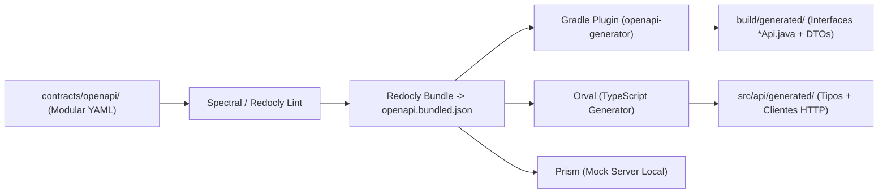

# Arquitetura e Diretrizes: API-First e Contratos de API no ispERP
**Documento Oficial de Engenharia & Governança**  
**Data de Consolidação:** 2026-09-03  
**Status:** Oficial / Consolidado  
**Regra Vinculada:** [`.agents/rules/api-first-contracts.md`](file:///Users/ruy/Code/ispERP/.agents/rules/api-first-contracts.md)  

---

## 1. Visão Geral e Princípios Fundamentais

O **ispERP** adota oficialmente a estratégia **API-First (Design-First)** como padrão arquitetural para toda comunicação entre serviços, clientes e integrações externas.

Nesse modelo, a interface de comunicação não é tratada como um subproduto do código do backend, mas sim como um **ativo de engenharia de primeira classe**, versionado e estritamente tipado antes de qualquer linha de implementação.

### Objetivos Estratégicos de Longo Prazo
1. **Suporte Nativo a Múltiplos Clientes:** O mesmo contrato alimenta o Frontend Administrativo Web (React), o Portal do Assinante, o futuro Aplicativo Mobile dos Técnicos em Campo (Flutter ou React Native) e integrações de parceiros (Redes Neutras / Open Finance).
2. **Evolução Fluida para Microsserviços:** Domínios de negócio com alta carga ou requisitos regulatórios específicos (Faturamento/Billing, Autenticação RADIUS, Triagem de O.S., Fiscal/NFCom) podem ser desacoplados em serviços autônomos preservando 100% de compatibilidade com os clientes.
3. **Desenvolvimento Paralelo Sem Bloqueios:** O time de frontend pode construir telas e fluxos inteiros utilizando servidores de mock locais (`prism`), sem depender do backend ter tabelas ou migrations prontas.
4. **Eliminação de Retrabalho:** Acaba a digitação manual de interfaces TypeScript e métodos Axios redundantes, bem como a criação braçal de DTOs no Java.

---

## 2. Diagnóstico do Modelo Legado (Code-First)

Antes da transição para API-First, o ispERP operava no modelo Code-First manual, onde o backend gerava o Swagger via Springdoc e o frontend escrevia chamadas e tipos manualmente. Uma auditoria no código identificou divergências críticas em produção:

| Módulo | Frontend (`frontend/src/services/`) | Backend (`backend/src/main/.../controller/`) | Impacto Real |
| :--- | :--- | :--- | :--- |
| **Ordens de Serviço** | `api.put('/work-orders/${id}/schedule')`<br>`api.put('/work-orders/${id}/complete')` | `@PostMapping("/{id}/schedule")`<br>`@PostMapping("/{id}/complete")` | **`405 Method Not Allowed`** em operações essenciais de campo. |
| **Ordens de Serviço** | `api.put('/work-orders/${id}/assign')`<br>`api.post('/work-orders')` | Inexistentes no controller principal (alocação foi para `InstallationDispatchController`). | **`404 Not Found`** em chamadas legadas do frontend. |
| **Faturamento** | `api.put('/invoices/${id}/pay')`<br>`api.put('/invoices/${id}/cancel')` | `@PostMapping("/{id}/pay")`<br>`@PostMapping("/{id}/cancel")` | **`405 Method Not Allowed`** na baixa e cancelamento de faturas. |
| **Faturamento** | `api.post('/invoices/generate-monthly')` | `@PostMapping("/trigger-recurring-billing")` | **`404 Not Found`** no disparo de rotina mensal. |
| **Contratos** | `api.put('/contracts/${id}/status', { status })` (JSON body) | `@PatchMapping("/{id}/status")` (`@RequestParam status` na URL) | **`400 Bad Request`** ou status ignorado. |
| **Clientes** | `api.get('/customers/search?q=...')` | `@GetMapping("/search/name")`<br>`@GetMapping("/search/cpf")` | **`404 Not Found`** na busca unificada de clientes. |

---

## 3. Diretriz de Segurança e Blindagem Patrimonial (Zero Trust DTOs)

A adoção do API-First aumenta substancialmente a segurança do ispERP:

1. **Prevenção contra *Mass Assignment* (CWE-915):**
   - NUNCA uma entidade JPA (`@Entity`) é exposta ou recebida diretamente nos endpoints.
   - O gerador de código força os controllers a receberem exclusivamente os DTOs declarados no contrato, garantindo que campos internos (`password_hash`, `tenant_id`, `audit_flags`, `role`) nunca sejam manipulados por requisições maliciosas.
2. **Validação Estrita Centralizada:**
   - Regras de validação (formatos RFC de UUIDv7, regex de CPF/CNPJ, tamanho de strings, valores monetários positivos) são declaradas uma única vez no YAML do contrato e aplicadas automaticamente via Bean Validation (`@Valid`, `@NotNull`, `@Pattern`) no Java e tipagem estrita no TypeScript.
3. **Padronização RFC 7807 (Problem Details):**
   - Respostas de erro nunca expõem nomes de tabelas, stacktraces do Spring ou detalhes de infraestrutura do PostgreSQL. As falhas seguem um JSON padronizado e seguro.
4. **Proteção de Dados em Trânsito:**
   - Elimina-se o uso indevido de `@RequestParam` para dados sensíveis em operações de escrita/alteração, garantindo que dados trafeguem apenas no corpo criptografado via HTTPS, sem vazamento em logs de URLs de proxies reversos.

---

## 4. Topologia Modular dos Contratos (`contracts/openapi/`)

Para manter alta legibilidade e evitar conflitos em branches do Git, a especificação é modularizada com `$ref`:

```text
ispERP/
├── contracts/
│   └── openapi/
│       ├── openapi.yaml                 # Ponto de entrada central (Info, Servers, Security, Tags)
│       ├── components/
│       │   ├── security.yaml            # Esquema JWT Bearer (RFC 7519)
│       │   ├── errors.yaml              # Padronização RFC 7807 (Problem Details)
│       │   └── common.yaml              # Tipos utilitários (UUIDv7, Paginação, Enums de auditoria)
│       └── domains/
│           ├── workorders/              # O.S. e Execução Técnica de Campo
│           │   ├── workorders.yaml      # Endpoints: /work-orders, /schedule, /complete
│           │   ├── execution.yaml       # Endpoints: /technician/execution (OLT Auto-Discovery, RADIUS)
│           │   └── schemas.yaml         # DTOs de O.S. e equipamentos
│           ├── billing/                 # Faturamento e Cobrança
│           │   ├── invoices.yaml        # Endpoints: /invoices, baixa, cancelamento, lote
│           │   └── schemas.yaml         # DTOs de fatura e transação
│           ├── contracts/               # Contratos e Assinatura Digital
│           │   ├── contracts.yaml       # Endpoints: /contracts, status
│           │   └── schemas.yaml         # DTOs de minuta e assinatura
│           └── customers/               # Clientes e Busca
│               ├── customers.yaml       # Endpoints: /customers, /search unificado
│               └── schemas.yaml         # DTOs de cadastro e consulta
```

---

## 5. Ferramentas e Pipeline de Automação



* **Linter de Contratos (Spectral / Redocly):** Garante que nenhuma rota seja criada sem descrição, sem esquema de segurança ou sem códigos de erro padronizados.
* **Bundler (Redocly):** Resolve todas as árvores de `$ref` e gera o artefato canônico `openapi.bundled.json`.
* **Backend Generator (OpenAPI Generator Gradle Plugin):**
  - Configurado com `interfaceOnly = true`. Gera apenas as interfaces Spring MVC e os DTOs Java 25.
  - Os Controllers Java simplesmente implementam a interface (ex: `public class WorkOrderController implements WorkOrdersApi`). Se a interface mudar, o compilador Java acusa o erro imediatamente.
* **Frontend Generator (Orval):**
  - Gera clientes Axios integrados ao interceptor JWT existente em `src/services/api.ts`.
  - Gera 100% das interfaces TypeScript. Se o contrato mudar, o `tsc --noEmit` falha na hora.
* **Servidor de Mocks (Prism):**
  - Permite rodar `npx prism mock contracts/openapi/openapi.bundled.json -p 4010` para testar telas do frontend com respostas sintéticas válidas.
* **Visualizador de Documentação Interativa (Redocly):**
  - Executar `./scripts/view-docs.sh` para abrir o servidor local com *live-reload* em `http://localhost:8085`.
  - Executar `./scripts/view-docs.sh --portal` para compilar e abrir o portal completo no navegador local.
  - Executar `./scripts/view-docs.sh --html` para compilar um único arquivo HTML estático em `docs/api-reference.html`.
* **Portal de Documentação & Publicação no GitHub Pages:**
  - O portal unificado em `docs/portal/` integra a **Landing Page do Projeto** (`index.html`) com a aba interativa de **Contratos OpenAPI Redocly** (`api.html`).
  - Script de build automatizado: `./scripts/build-portal.sh [DIRETORIO_DESTINO]`.
  - Pipeline de CI/CD: `.github/workflows/deploy-pages.yml` compila e publica automaticamente no GitHub Pages a cada push em `main` que altere contratos ou documentação.

---

## 6. Fluxo de Trabalho Diário (Step-by-Step)

Sempre que uma nova funcionalidade, campo ou rota for necessária:

1. **Passo 1 (Contrato Primeiro):** Declarar o endpoint ou o novo campo no arquivo YAML do domínio correspondente em `contracts/openapi/domains/`.
2. **Passo 2 (Codegen Automatizado):** Executar `./scripts/generate-api.sh`.
   - O Java recebe as novas interfaces e DTOs.
   - O TypeScript recebe as novas tipagens e métodos de cliente prontos.
3. **Passo 3 (Implementação Desacoplada):**
   - **No Backend:** Implementar a lógica de negócio no Controller/Service (sem perder tempo criando DTOs ou anotações HTTP manuais).
   - **No Frontend:** Consumir a função tipada nos componentes React (sem perder tempo criando interfaces ou métodos de Axios manuais).
4. **Passo 4 (Visualização & Validação):** Usar `./scripts/view-docs.sh` para inspecionar visualmente a documentação interativa.

---

## 7. Roteiro Estruturado de Migração

A migração do ispERP para o modelo API-First foi estruturada em fases incrementais:

* **Fase 1 — Infraestrutura de Contratos:** `[CONCLUÍDO]`
  - Criação da pasta `contracts/openapi/` e dos domínios críticos (`WorkOrders`, `Billing`, `Contracts`, `Customers`).
  - Criação do script de bundling e validação (`scripts/bundle-contracts.sh`).
* **Fase 2 — Migração do Backend:** `[CONCLUÍDO]`
  - Configuração do plugin `org.openapi.generator:7.11.0` no Gradle.
  - Conexão dos Controllers Spring Boot existentes com as interfaces geradas (módulo piloto de Ordens de Serviço e Execução Técnica de Campo).
  - Criação de testes unitários (`WorkOrderControllerTest`).
* **Fase 3 — Migração do Frontend:** `[CONCLUÍDO]`
  - Configuração do `Orval` no `frontend/package.json` e `orval.config.ts`.
  - Conexão do interceptor JWT de `api.ts` com o mutator do Orval.
  - Migração de `workOrderService.ts` e `onboardingDispatchService.ts` para os métodos gerados, corrigindo verbos HTTP.
* **Fase 4 — Expansão para os demais domínios (Faturamento, Contratos, Clientes):** `[PRÓXIMA]`
  - Conectar os demais controllers legados (`InvoiceController`, `ContractController`, `CustomerController`) às interfaces geradas pelo contrato.
* **Fase 4 — CI/CD & Governança Automática:**
  - Inclusão do job de validação de contratos no GitHub Actions (`fail-fast`), impedindo merges com divergências de contrato.

---

## 8. Contratos do Portal do Assinante e Gestão de PIN (`/api/portal/client` e `/customers/{id}/reset-pin`)

O ecossistema desacoplado da Central do Assinante (`frontend-customer`) consome endpoints públicos protegidos por autenticação de documento e PIN de 4 dígitos. Além disso, os operadores administrativos do ERP possuem endpoints auditados para suporte e reset de credenciais.

### 8.1. Autenticação do Assinante (`POST /api/portal/client/auth`)
Permite login sem atritos via CPF ou CNPJ, com validação de PIN de 4 dígitos numéricos quando existente.
- **Rota:** `POST /api/portal/client/auth`
- **Acesso:** Público (`permitAll()`)
- **Corpo da Requisição (JSON):**
  ```json
  {
    "document": "200.370.410-88",
    "pin": "1234"
  }
  ```
  *(O campo `pin` é opcional na primeira tentativa caso o cliente ainda não possua PIN)*
- **Respostas Possíveis:**
  - `200 OK` com `status: "AUTHENTICATED"`: Acesso liberado. Retorna `customerId`, `customerName`, `maskedDocument`, `hasPin: true/false` e objeto `customer`.
  - `200 OK` com `status: "PIN_REQUIRED"`: Cliente possui PIN cadastrado, exigindo o envio do PIN de 4 dígitos.
  - `200 OK` com `status: "FORCE_CHANGE_PIN"`: O PIN foi resetado pelo suporte do provedor ou está expirado. O cliente deve cadastrar um novo PIN antes de acessar o dashboard.
  - `400 / 404`: Cliente não localizado com o CPF/CNPJ informado ou cadastro inativo.

### 8.2. Dashboard do Assinante (`GET /api/portal/client/dashboard`)
Retorna a visão unificada da conta do assinante: dados cadastrais, plano ativo, velocidades, status da conexão e faturas separadas por situação.
- **Rota:** `GET /api/portal/client/dashboard`
- **Identificação:** Via cabeçalho `X-Customer-Id: <UUID>` ou parâmetro `?customerId=<UUID>`
- **Resposta (`ClientPortalDashboardDTO`):**
  ```json
  {
    "customer": { "id": "...", "name": "...", "cpf": "..." },
    "contract": { "id": "...", "contractNumber": "CTR-2026-...", "status": "ACTIVE|SUSPENDED" },
    "currentPlan": { "name": "Fibra 300 Mega", "downloadSpeed": 300, "uploadSpeed": 150, "price": 79.90 },
    "availableUpgradePlans": [ ... ],
    "pendingInvoices": [ ... ],
    "overdueInvoices": [ ... ],
    "paidInvoices": [ ... ],
    "connectionBlocked": false,
    "canRequestTrustUnblock": false,
    "connectionStatusMessage": "Sua conexão está ativa e operando normalmente."
  }
  ```

### 8.3. Desbloqueio em Confiança de 48 Horas (`POST /api/portal/client/trust-unblock`)
Permite ao assinante com conexão suspensa por inadimplência solicitar o auto-desbloqueio temporário (48h) uma única vez a cada ciclo de faturamento.
- **Rota:** `POST /api/portal/client/trust-unblock`
- **Identificação:** `X-Customer-Id: <UUID>` ou `?customerId=<UUID>`
- **Corpo da Requisição (JSON):**
  ```json
  {
    "contractId": "01a0674f-0271-7b5f-999d-9313eb6e3b34"
  }
  ```
- **Resposta:** Registro `TrustUnblock` com `status: "ACTIVE"`, `expiresAt: <data+48h>`, disparando evento assíncrono `INTERNET_ACCESS_UNBLOCKED` no outbox para o concentrador de rede (MikroTik/Huawei/OLT).

### 8.4. Cadastro e Alteração de PIN pelo Cliente (`POST /api/portal/client/pin`)
Permite ao assinante cadastrar seu primeiro PIN de 4 dígitos ou atualizar o PIN existente.
- **Rota:** `POST /api/portal/client/pin`
- **Corpo da Requisição (JSON):**
  ```json
  {
    "customerId": "01a0674f-0271-75a2-999c-b1faa8ae6a66",
    "newPin": "5678",
    "currentPin": "1234"
  }
  ```
  *(O campo `currentPin` é opcional se o cliente ainda não possui PIN cadastrado ou se estiver em estado de troca forçada `FORCE_CHANGE_PIN`)*
- **Validação:** Criptografia BCrypt, tamanho exato de 4 dígitos numéricos (`^\\d{4}$`).
- **Resposta:** `200 OK` `{ "message": "PIN de 4 dígitos configurado com sucesso." }`

### 8.5. Atualização Cadastral pelo Cliente (`PUT /api/portal/client/profile`)
Permite ao assinante manter seus dados de contato e endereço atualizados na Central.
- **Rota:** `PUT /api/portal/client/profile`
- **Corpo da Requisição:** `UpdateClientProfileRequest` (nome, email, telefone, endereço, cidade, estado, cep).

### 8.6. Reset Administrativo de PIN pelo Atendente (`POST /customers/{id}/reset-pin`)
Disponível exclusivamente para atendentes e operadores do ERP autenticados via JWT. Permite definir um PIN temporário ou forçar a troca no próximo acesso do cliente.
- **Rota:** `POST /customers/{id}/reset-pin`
- **Acesso:** Autenticado com perfil ERP (`ROLE_ADMIN`, `ROLE_ATTENDANT`, `ROLE_FINANCIAL`)
- **Corpo da Requisição (JSON):**
  ```json
  {
    "temporaryPin": "1234",
    "forceChange": true
  }
  ```
- **Auditoria:** Toda execução gera log imutável de auditoria (`CUSTOMER_PIN_RESET`) no `AuditLogService` com identificação do operador, IP e timestamp.
- **Resposta:** `200 OK` `{ "message": "PIN resetado com sucesso pelo operador.", "temporaryPin": "1234", "forceChange": true }`

