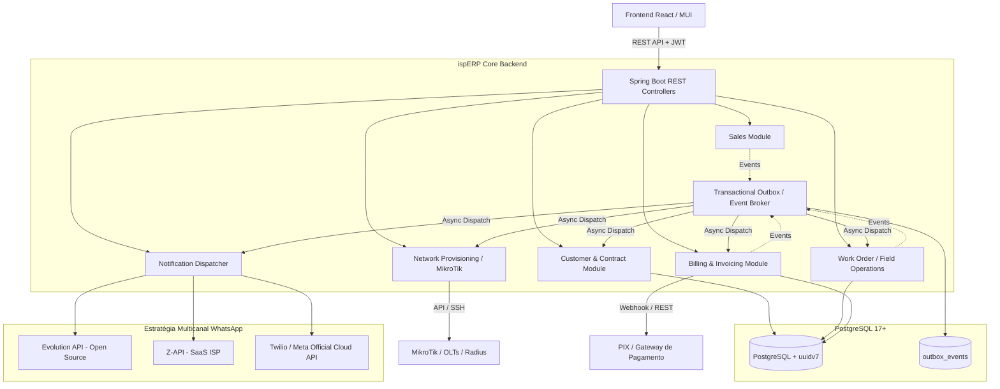

# Arquitetura e Decisões Técnicas (ADR & Architecture Blueprint)

## 1. Visão Geral da Arquitetura

O **ispERP** adota a arquitetura de **Monólito Modular Orientado a Eventos (Event-Driven Modular Monolith)**. Esse padrão combina a facilidade de deploy e desenvolvimento de um monólito com o baixo acoplamento, alta coesão e assincronia de microsserviços.

---

## 2. Decisões Arquiteturais Fundamentais (ADRs)

### ADR 001: Adoção do PostgreSQL 17+ (com suporte nativo a UUIDv7)
- **Contexto:** Suporte nativo à função `uuidv7()` diretamente no SQL sem a necessidade de extensões externas no banco, além de suporte a `JSONB` de alta performance e concorrência avançada (MVCC).
- **Decisão:** Utilizar PostgreSQL 17 (imagem `postgres:17-alpine`).
- **Consequências:**
  - O banco suporta nativamente `id UUID PRIMARY KEY DEFAULT uuidv7()`.
  - Consultas e migrações SQL podem gerar UUIDs v7 nativamente sem dependências C extras.

---

### ADR 002: Identificadores UUIDv7 no Backend e no Banco
- **Contexto:** Na arquitetura orientada a eventos (EDA), precisamos conhecer o identificador da entidade em memória antes da persistência para publicar eventos de domínio com IDs correlacionados (ex: `SaleSubmittedEvent` já precisa carregar o `saleId`).
- **Decisão:** 
  - **No Banco (PostgreSQL 17+):** Colunas `UUID DEFAULT uuidv7()`.
  - **No Backend Java (Java 21):** Biblioteca `com.github.f4b6a3:uuid-creator` (RFC 9562, ultra-leve, zero dependências adicionais).
- **Vantagens:**
  - Ordenação cronológica (índices B-Tree com eficiência idêntica a inteiros sequenciais).
  - Segurança antienumeração (proteção contra ataques de enumeração IDOR).

---

### ADR 003: Arquitetura Orientada a Eventos (EDA) & Transactional Outbox
- **Contexto:** Operações de provedores dependem de serviços externos com latências e taxas de falha variadas (geração de cobrança bancária, provisionamento no MikroTik, envio de WhatsApp). Executar tudo em uma única transação síncrona gera timeout, locks no banco e falhas em cascata.
- **Decisão:** Desacoplar os processos de negócio em **Domain Events** com padrão **Transactional Outbox**.
- **Mecanismo:**
  1. O comando (ex: Registrar Venda) persiste os dados da entidade e insere o evento na tabela `outbox_events` dentro da **mesma transação ACID**.
  2. Um dispatcher assíncrono (Spring `@TransactionalEventListener(phase = AFTER_COMMIT)`) processa o evento e o encaminha aos consumidores correspondentes.
  3. Consumidores são **idempotentes** (gravam o `event_id` na tabela `processed_events` para evitar duplicações).

---

### ADR 004: Provedores de WhatsApp Plugáveis (Adapter / Strategy Pattern)
- **Contexto:** Diferentes provedores de internet possuem orçamentos e estruturas distintas: alguns preferem servidores próprios abertos (Evolution API), outros preferem facilidade SaaS (Z-API) e outros exigem a API Oficial da Meta (Twilio / Meta Cloud API).
- **Decisão:** Criar a interface `WhatsAppProvider` com implementação de 3 adaptadores plugáveis selecionáveis por empresa (`Company`):
  1. `EvolutionApiWhatsAppProvider` (Open Source, self-hosted).
  2. `ZApiWhatsAppProvider` (SaaS comercial).
  3. `TwilioWhatsAppProvider` / `MetaOfficialWhatsAppProvider` (API Oficial).

---

### ADR 005: Segurança, RBAC e Conformidade LGPD
- **Princípio da Segurança em Primeiro Lugar:**
  - **Autenticação:** JWT Stateless com rotação de segredo.
  - **Autorização (RBAC):** Anotações `@PreAuthorize` granulares em nível de serviço/controlador.
  - **Proteção de Dados Sensíveis:** Validação e mascaramento de CPF/CNPJ nos logs. Armazenamento seguro de chaves de API.
  - **Auditoria:** Registro imutável de logs de alteração cadastral e liberação manual de sinal na tabela `audit_logs`.

---

### ADR 006: Estratégia de Testes Automatizados (TDD & Pirâmide de Testes)
- **Regra:** Nenhuma nova funcionalidade ou refatoração é considerada concluída sem testes unitários cobrindo o caminho feliz, cenários de borda e validações de segurança.
- **Ferramentas:**
  - **Unitários:** JUnit 5 + Mockito + AssertJ.
  - **Integração:** `@DataJpaTest` com **Testcontainers PostgreSQL** (testando migrações reais do Flyway e queries nativas).
  - **Frontend:** React Testing Library + Jest.
