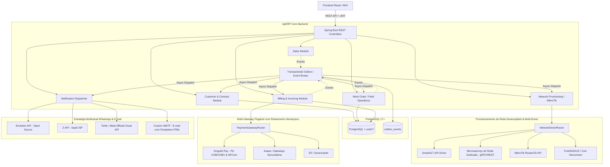
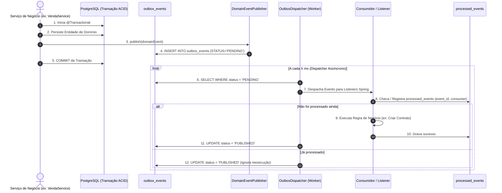

# Arquitetura e Decisões Técnicas (ADR & Architecture Blueprint)

## 1. Visão Geral da Arquitetura

O **ispERP** adota a arquitetura de **Monólito Modular Orientado a Eventos (Event-Driven Modular Monolith)**. Esse padrão combina a facilidade de deploy e desenvolvimento de um monólito com o baixo acoplamento, alta coesão e assincronia de microsserviços.

---

## 2. Decisões Arquiteturais Fundamentais (ADRs)

### ADR 001: Adoção do PostgreSQL 17+ (com suporte nativo a UUIDv7)
- **Contexto:** Suporte nativo à função `uuidv7()` diretamente no SQL sem a necessidade de extensões externas no banco, além de suporte a `JSONB` de alta performance e concorrência avançada (MVCC).
- **Decisão:** Utilizar PostgreSQL 17 (imagem `postgres:17-alpine`).
- **Consequências:**
  - O banco suporta nativamente `id UUID PRIMARY KEY DEFAULT uuidv7()`.
  - Consultas e migrações SQL podem gerar UUIDs v7 nativamente sem dependências C extras.

---

### ADR 002: Identificadores UUIDv7 no Backend e no Banco
- **Contexto:** Na arquitetura orientada a eventos (EDA), precisamos conhecer o identificador da entidade em memória antes da persistência para publicar eventos de domínio com IDs correlacionados (ex: `SaleSubmittedEvent` já precisa carregar o `saleId`).
- **Decisão:** 
  - **No Banco (PostgreSQL 17+):** Colunas `UUID DEFAULT uuidv7()`.
  - **No Backend Java (Java 25):** Biblioteca `com.github.f4b6a3:uuid-creator` (RFC 9562, ultra-leve, zero dependências adicionais).
- **Vantagens:**
  - Ordenação cronológica (índices B-Tree com eficiência idêntica a inteiros sequenciais).
  - Segurança antienumeração (proteção contra ataques de enumeração IDOR).

---

### ADR 003: Arquitetura Orientada a Eventos (EDA) & Transactional Outbox
- **Contexto:** Operações de provedores dependem de serviços externos com latências e taxas de falha variadas (geração de cobrança bancária, provisionamento no MikroTik, envio de WhatsApp). Executar tudo em uma única transação síncrona gera timeout, locks no banco e falhas em cascata.
- **Decisão:** Desacoplar os processos de negócio em **Domain Events** com padrão **Transactional Outbox**.
- **Mecanismo Detalhado do Transactional Outbox:**

- **Garantias:**
  1. **Consistência Atômica:** O evento é salvo na tabela `outbox_events` na mesma transação JDBC da alteração de negócio.
  2. **Entrega Confiável (*At-least-once Delivery*):** Em caso de falha transitória ou queda do servidor, o `OutboxDispatcher` reprocessa com backoff exponencial.
  3. **Consumo Idempotente (*Exactly-once Processing*):** A tabela `processed_events` (`PRIMARY KEY (event_id, consumer_name)`) protege contra processamentos duplicados.

---

### ADR 004: Notificações Multicanal Plugáveis (WhatsApp Adapters & E-mail SMTP Dinâmico)
- **Contexto:** Provedores de internet precisam se comunicar com o assinante por múltiplos canais. O canal de WhatsApp varia de acordo com o porte do ISP (Evolution API open-source, Z-API ou Twilio/Meta Oficial), enquanto o canal de E-mail exige envio confiável via servidor **SMTP customizado por empresa** com templates HTML responsivos para faturas e lembretes.
- **Decisão:** Criar interfaces desacopladas (`WhatsAppProvider` e `EmailNotificationProvider`) com suporte a:
  1. **WhatsApp (Strategy Pattern):**
     - `EvolutionApiWhatsAppProvider` (Open Source, self-hosted via Docker).
     - `ZApiWhatsAppProvider` (SaaS especializado em ISPs).
     - `TwilioWhatsAppProvider` / `MetaOfficialWhatsAppProvider` (API Oficial Cloud da Meta).
  2. **E-mail (Custom SMTP Provider):**
     - Configuração dinâmica por empresa (`smtp_host`, `smtp_port`, `smtp_username`, `smtp_password`, `smtp_use_tls`, `smtp_from_email`, `smtp_from_name`).
     - Renderização de templates HTML modernos para faturas, avisos de vencimento, comprovantes de pagamento e carnês anexados em PDF.

---

### ADR 005: Segurança, RBAC e Conformidade LGPD
- **Princípio da Segurança em Primeiro Lugar:**
  - **Autenticação:** JWT Stateless com rotação de segredo.
  - **Autorização (RBAC):** Anotações `@PreAuthorize` granulares em nível de serviço/controlador.
  - **Proteção de Dados Sensíveis:** Validação e mascaramento de CPF/CNPJ nos logs. Armazenamento seguro de chaves de API.
  - **Auditoria:** Registro imutável de logs de alteração cadastral e liberação manual de sinal na tabela `audit_logs`.

---

### ADR 006: Estratégia de Testes Automatizados (TDD & Pirâmide de Testes)
- **Regra:** Nenhuma nova funcionalidade ou refatoração é considerada concluída sem testes unitários cobrindo o caminho feliz, cenários de borda e validações de segurança.
- **Ferramentas:**
  - **Unitários:** JUnit 5 + Mockito + AssertJ.
  - **Integração:** `@DataJpaTest` com **Testcontainers PostgreSQL** (testando migrações reais do Flyway e queries nativas).
  - **Frontend:** React Testing Library + Jest.

---

### ADR 007: Arquitetura de Multi-Gateways de Pagamento com Roteamento Hierárquico
- **Contexto:** Provedores de internet frequentemente operam com múltiplos gateways de pagamento para contingência, divisão de taxas ou acordos corporativos específicos. É necessário poder trocar de gateway sem quebrar faturas emitidas no passado, além de suportar gateways diferentes por plano ou cliente simultaneamente.
- **Decisão:** Implementar o padrão **Strategy + Hierarchical Router Pattern** via interface `PaymentGateway`:
  1. **Hierarquia de Roteamento Dinâmico:**
     - **Nível 1 (Contrato/Cliente):** Se o contrato possuir `gateway_config_id` específico (ex: cliente corporativo negociado), usa este gateway.
     - **Nível 2 (Plano):** Se o plano possuir `gateway_config_id` configurado (ex: plano de alta velocidade em promoção via Pix), usa este gateway.
     - **Nível 3 (Padrão da Empresa):** Se nenhum dos níveis acima estiver definido, usa o gateway padrão ativo da `Company`.
  2. **Primeiro Gateway Suportado: Xingubit Pay (`https://pay.xingubit.com.br/doc`):**
     - Autenticação OAuth 2.0 (`/v1/oauth/token` com `client_id` e `client_secret`).
     - Emissão de Pix Imediato (COB) e Pix com Vencimento (COBV com juros e multa diária).
     - Geração de Carnês Pix parcelados.
     - Webhooks em tempo real (`POST /api/webhooks/payments/xingubit`) para confirmação instantânea de pagamento (`PaymentConfirmedEvent`).
     - Integração com emissão fiscal unificada (NFCom).
  3. **Imutabilidade e Rastreabilidade da Fatura:**
     - Cada registro de `Invoice` armazena o `gateway_type`, `gateway_tx_id` e `gateway_payload` original. Se a empresa alterar o gateway padrão para cobranças futuras, faturas passadas continuam funcionando e recebendo webhooks normalmente.

---

### ADR 008: Provisionamento de Rede Desacoplado & Multi-Driver (SmartOLT, Microsserviço, MikroTik, Radius)
- **Contexto:** Provedores de internet possuem topologias de rede heterogêneas. Pequenos ISPs utilizam concentradores MikroTik locais; médios e grandes provedores utilizam SmartOLT para gerenciar OLTs (Huawei, ZTE, Fiberhome); outros operam com servidores FreeRADIUS dedicados ou microsserviços de rede isolados para isolamento de carga e segurança de borda.
- **Decisão:** Modelar a camada de rede 100% desacoplada orientada a eventos através da interface `NetworkProvisioner` e do roteador `NetworkDriverResolver`:
  1. **Tipos de Drivers Suportados (Plugáveis):**
     - `SmartOltProvisioner`: Integração com a API REST do SmartOLT para autorização de ONUs e alteração de profiles.
     - `ExternalMicroserviceProvisioner`: Comunicação assíncrona (gRPC ou REST) com um microsserviço externo especializado em automação de rede.
     - `RadiusCoAProvisioner`: Envio de pacotes CoA (Change of Authorization / Disconnect) para servidores Radius.
     - `MockNetworkProvisioner`: Driver passivo para homologação e testes unitários/integrados.
  2. **Gatilhos por Eventos de Domínio:**
     - `WorkOrderCompletedEvent` ➡️ `driver.provisionOnu(onu)`
     - `InvoicePaidEvent` ➡️ `driver.unblockSubscriber(subscriber)`
     - `ContractBlockedEvent` (Inadimplência) ➡️ `driver.suspendSubscriber(subscriber)`
  3. **Associação Flexível:** Cada Ponto de Acesso / POP / Concentrador define qual `network_driver_type` e `network_driver_config_id` deve ser utilizado, permitindo ao ERP operar com múltiplos provedores de rede em paralelo.

---

### ADR 009: Almoxarifado Multi-Depósito, Ativos Serializados e Termos de Custódia de Técnicos
- **Contexto:** ISPs enfrentam frequentes perdas de patrimônio, descontrole de insumos entre o depósito central e veículos técnicos, e extravio de ferramentas de alto valor (máquinas de fusão, OTDRs, clivadores).
- **Decisão:** Implementar modelo de dados (`V10`) com controle multi-depósito (`warehouses`), transferências rastreadas (`stock_transfers`), rastreamento unitário por número de série/MAC (`serialized_assets`) e termos formais de custódia com log de auditoria imutável (`tool_custody_agreements`, `custody_logs`).
- **Consequências:** 
  - Todo ativo possui ciclo de vida rastreado: `AVAILABLE`, `IN_TRANSFER`, `IN_CUSTODY`, `INSTALLED`, `DAMAGED`, `RETIRED`.
  - Técnicos assumem formalmente a responsabilidade por ferramentas caras mediante termo de custódia assinado.

---

### ADR 010: Faturamento Hierárquico Multi-Empresa e Rebalanceamento Pro-Rata
- **Contexto:** Clientes corporativos com matriz e múltiplas filiais exigem faturamento centralizado (uma única fatura consolidada cobrindo múltiplos contratos). Além disso, trocas de plano no meio do ciclo de faturamento geram inconsistências contábeis se o cálculo pro-rata não for automatizado.
- **Decisão:** Implementar entidades e serviços de faturamento hierárquico (`V11`, `HierarchicalBillingService`) e rebalanceamento inteligente (`InvoiceRebalanceService`).
- **Consequências:**
  - Suporte a faturas consolidadas ou segregadas por filial com rateio proporcional.
  - Cálculo exato de dias utilizados no plano anterior vs. novo plano, gerando faturas complementares ou abatimentos no ciclo subsequente.

---

### ADR 011: Central de Atendimento (Helpdesk) com Protocolos Regulatórios Anatel e Classificação Fiscal NFCom
- **Contexto:** Provedores de internet no Brasil são regulados pela Anatel (exigência de numeração única de protocolo de atendimento) e pela SEFAZ (obrigatoriedade da NFCom Modelo 62 com segregação precisa entre serviços de telecomunicação SCM e serviços de valor agregado SVA).
- **Decisão:** Implementar módulo de Helpdesk (`V12`, `HelpdeskService`) com gerador de protocolos Anatel (`AnatelProtocolGenerator`), matriz de cálculo de SLA e motor de decisão fiscal (`NfcomDecisionService`).
- **Consequências:**
  - Todo chamado gera protocolo único no formato `YYYYMMDD-XXXXXX` rastreável em todas as interações.
  - Cada item cobrado é classificado automaticamente para tributação correta (ICMS sobre SCM / ISS sobre SVA).

---

### ADR 012: Governança Estrita de Tipagem e Null-Safety com JSpecify no Java 25
- **Contexto:** Falhas por `NullPointerException` (NPE) em tempo de execução são críticas para sistemas de missão crítica como ERPs de telecomunicações. Anotações legadas (@NonNullApi do Spring) causavam conflitos com Lombok e IDEs modernas.
- **Decisão:** Adotar a especificação padrão da indústria **JSpecify** (`org.jspecify.annotations:jspecify`), anotando todos os pacotes com `@NullMarked` em `package-info.java` e sinalizando explicitamente campos e retornos opcionais com `@Nullable`.
- **Consequências:**
  - Análise estática em tempo de compilação sem falsos-positivos com Lombok.
  - Código 100% autodocumentado quanto a contratos de nulidade.

