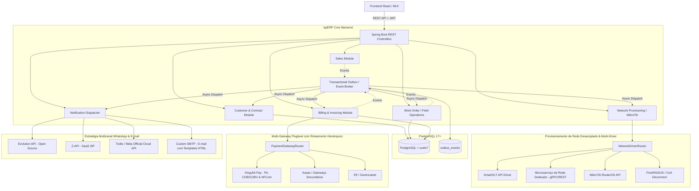
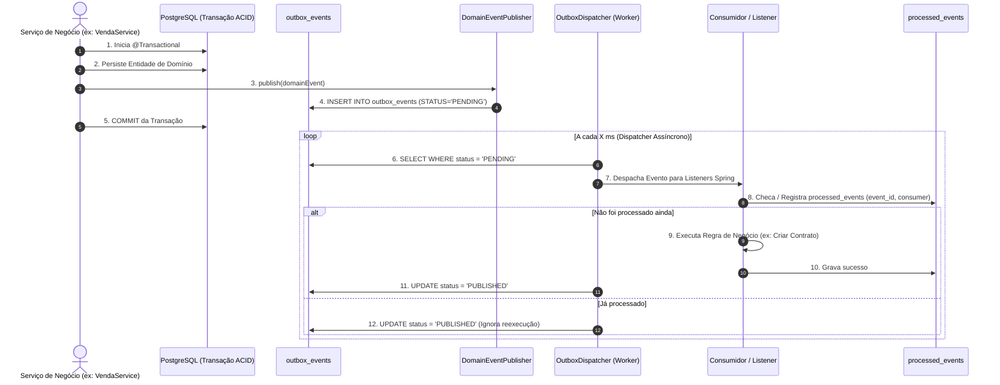

# Arquitetura e Decisões Técnicas (ADR & Architecture Blueprint)

## 1. Visão Geral da Arquitetura

O **ispERP** adota a arquitetura de **Monólito Modular Orientado a Eventos (Event-Driven Modular Monolith)**. Esse padrão combina a facilidade de deploy e desenvolvimento de um monólito com o baixo acoplamento, alta coesão e assincronia de microsserviços.

---

## 2. Decisões Arquiteturais Fundamentais (ADRs)

### ADR 001: Adoção do PostgreSQL 17+ (com suporte nativo a UUIDv7)
- **Contexto:** Suporte nativo à função `uuidv7()` diretamente no SQL sem a necessidade de extensões externas no banco, além de suporte a `JSONB` de alta performance e concorrência avançada (MVCC).
- **Decisão:** Utilizar PostgreSQL 17 (imagem `postgres:17-alpine`).
- **Consequências:**
  - O banco suporta nativamente `id UUID PRIMARY KEY DEFAULT uuidv7()`.
  - Consultas e migrações SQL podem gerar UUIDs v7 nativamente sem dependências C extras.

---

### ADR 002: Identificadores UUIDv7 no Backend e no Banco
- **Contexto:** Na arquitetura orientada a eventos (EDA), precisamos conhecer o identificador da entidade em memória antes da persistência para publicar eventos de domínio com IDs correlacionados (ex: `SaleSubmittedEvent` já precisa carregar o `saleId`).
- **Decisão:** 
  - **No Banco (PostgreSQL 17+):** Colunas `UUID DEFAULT uuidv7()`.
  - **No Backend Java (Java 25):** Biblioteca `com.github.f4b6a3:uuid-creator` (RFC 9562, ultra-leve, zero dependências adicionais).
- **Vantagens:**
  - Ordenação cronológica (índices B-Tree com eficiência idêntica a inteiros sequenciais).
  - Segurança antienumeração (proteção contra ataques de enumeração IDOR).

---

### ADR 003: Arquitetura Orientada a Eventos (EDA) & Transactional Outbox
- **Contexto:** Operações de provedores dependem de serviços externos com latências e taxas de falha variadas (geração de cobrança bancária, provisionamento no MikroTik, envio de WhatsApp). Executar tudo em uma única transação síncrona gera timeout, locks no banco e falhas em cascata.
- **Decisão:** Desacoplar os processos de negócio em **Domain Events** com padrão **Transactional Outbox**.
- **Mecanismo Detalhado do Transactional Outbox:**

- **Garantias:**
  1. **Consistência Atômica:** O evento é salvo na tabela `outbox_events` na mesma transação JDBC da alteração de negócio.
  2. **Entrega Confiável (*At-least-once Delivery*):** Em caso de falha transitória ou queda do servidor, o `OutboxDispatcher` reprocessa com backoff exponencial.
  3. **Consumo Idempotente (*Exactly-once Processing*):** A tabela `processed_events` (`PRIMARY KEY (event_id, consumer_name)`) protege contra processamentos duplicados.

---

### ADR 004: Notificações Multicanal Plugáveis (WhatsApp Adapters & E-mail SMTP Dinâmico)
- **Contexto:** Provedores de internet precisam se comunicar com o assinante por múltiplos canais. O canal de WhatsApp varia de acordo com o porte do ISP (Evolution API open-source, Z-API ou Twilio/Meta Oficial), enquanto o canal de E-mail exige envio confiável via servidor **SMTP customizado por empresa** com templates HTML responsivos para faturas e lembretes.
- **Decisão:** Criar interfaces desacopladas (`WhatsAppProvider` e `EmailNotificationProvider`) com suporte a:
  1. **WhatsApp (Strategy Pattern):**
     - `EvolutionApiWhatsAppProvider` (Open Source, self-hosted via Docker).
     - `ZApiWhatsAppProvider` (SaaS especializado em ISPs).
     - `TwilioWhatsAppProvider` / `MetaOfficialWhatsAppProvider` (API Oficial Cloud da Meta).
  2. **E-mail (Custom SMTP Provider):**
     - Configuração dinâmica por empresa (`smtp_host`, `smtp_port`, `smtp_username`, `smtp_password`, `smtp_use_tls`, `smtp_from_email`, `smtp_from_name`).
     - Renderização de templates HTML modernos para faturas, avisos de vencimento, comprovantes de pagamento e carnês anexados em PDF.

---

### ADR 005: Segurança, RBAC e Conformidade LGPD
- **Princípio da Segurança em Primeiro Lugar:**
  - **Autenticação:** JWT Stateless com rotação de segredo.
  - **Autorização (RBAC):** Anotações `@PreAuthorize` granulares em nível de serviço/controlador.
  - **Proteção de Dados Sensíveis:** Validação e mascaramento de CPF/CNPJ nos logs. Armazenamento seguro de chaves de API.
  - **Auditoria:** Registro imutável de logs de alteração cadastral e liberação manual de sinal na tabela `audit_logs`.

---

### ADR 006: Estratégia de Testes Automatizados (TDD & Pirâmide de Testes)
- **Regra:** Nenhuma nova funcionalidade ou refatoração é considerada concluída sem testes unitários cobrindo o caminho feliz, cenários de borda e validações de segurança.
- **Ferramentas:**
  - **Unitários:** JUnit 5 + Mockito + AssertJ.
  - **Integração:** `@DataJpaTest` com **Testcontainers PostgreSQL** (testando migrações reais do Flyway e queries nativas).
  - **Frontend:** React Testing Library + Jest.

---

### ADR 007: Arquitetura de Multi-Gateways de Pagamento com Roteamento Hierárquico
- **Contexto:** Provedores de internet frequentemente operam com múltiplos gateways de pagamento para contingência, divisão de taxas ou acordos corporativos específicos. É necessário poder trocar de gateway sem quebrar faturas emitidas no passado, além de suportar gateways diferentes por plano ou cliente simultaneamente.
- **Decisão:** Implementar o padrão **Strategy + Hierarchical Router Pattern** via interface `PaymentGateway`:
  1. **Hierarquia de Roteamento Dinâmico:**
     - **Nível 1 (Contrato/Cliente):** Se o contrato possuir `gateway_config_id` específico (ex: cliente corporativo negociado), usa este gateway.
     - **Nível 2 (Plano):** Se o plano possuir `gateway_config_id` configurado (ex: plano de alta velocidade em promoção via Pix), usa este gateway.
     - **Nível 3 (Padrão da Empresa):** Se nenhum dos níveis acima estiver definido, usa o gateway padrão ativo da `Company`.
  2. **Primeiro Gateway Suportado: Xingubit Pay (`https://pay.xingubit.com.br/doc`):**
     - Autenticação OAuth 2.0 (`/v1/oauth/token` com `client_id` e `client_secret`).
     - Emissão de Pix Imediato (COB) e Pix com Vencimento (COBV com juros e multa diária).
     - Geração de Carnês Pix parcelados.
     - Webhooks em tempo real (`POST /api/webhooks/payments/xingubit`) para confirmação instantânea de pagamento (`PaymentConfirmedEvent`).
     - Integração com emissão fiscal unificada (NFCom).
  3. **Imutabilidade e Rastreabilidade da Fatura:**
     - Cada registro de `Invoice` armazena o `gateway_type`, `gateway_tx_id` e `gateway_payload` original. Se a empresa alterar o gateway padrão para cobranças futuras, faturas passadas continuam funcionando e recebendo webhooks normalmente.

---

### ADR 008: Provisionamento de Rede Desacoplado & Multi-Driver (SmartOLT, Microsserviço, MikroTik, Radius)
- **Contexto:** Provedores de internet possuem topologias de rede heterogêneas. Pequenos ISPs utilizam concentradores MikroTik locais; médios e grandes provedores utilizam SmartOLT para gerenciar OLTs (Huawei, ZTE, Fiberhome); outros operam com servidores FreeRADIUS dedicados ou microsserviços de rede isolados para isolamento de carga e segurança de borda.
- **Decisão:** Modelar a camada de rede 100% desacoplada orientada a eventos através da interface `NetworkProvisioner` e do roteador `NetworkDriverResolver`:
  1. **Tipos de Drivers Suportados (Plugáveis):**
     - `SmartOltProvisioner`: Integração com a API REST do SmartOLT para autorização de ONUs e alteração de profiles.
     - `ExternalMicroserviceProvisioner`: Comunicação assíncrona (gRPC ou REST) com um microsserviço externo especializado em automação de rede.
     - `RadiusCoAProvisioner`: Envio de pacotes CoA (Change of Authorization / Disconnect) para servidores Radius.
     - `MockNetworkProvisioner`: Driver passivo para homologação e testes unitários/integrados.
  2. **Gatilhos por Eventos de Domínio:**
     - `WorkOrderCompletedEvent` ➡️ `driver.provisionOnu(onu)`
     - `InvoicePaidEvent` ➡️ `driver.unblockSubscriber(subscriber)`
     - `ContractBlockedEvent` (Inadimplência) ➡️ `driver.suspendSubscriber(subscriber)`
  3. **Associação Flexível:** Cada Ponto de Acesso / POP / Concentrador define qual `network_driver_type` e `network_driver_config_id` deve ser utilizado, permitindo ao ERP operar com múltiplos provedores de rede em paralelo.

---

### ADR 009: Almoxarifado Multi-Depósito, Ativos Serializados e Termos de Custódia de Técnicos
- **Contexto:** ISPs enfrentam frequentes perdas de patrimônio, descontrole de insumos entre o depósito central e veículos técnicos, e extravio de ferramentas de alto valor (máquinas de fusão, OTDRs, clivadores).
- **Decisão:** Implementar modelo de dados (`V10`) com controle multi-depósito (`warehouses`), transferências rastreadas (`stock_transfers`), rastreamento unitário por número de série/MAC (`serialized_assets`) e termos formais de custódia com log de auditoria imutável (`tool_custody_agreements`, `custody_logs`).
- **Consequências:** 
  - Todo ativo possui ciclo de vida rastreado: `AVAILABLE`, `IN_TRANSFER`, `IN_CUSTODY`, `INSTALLED`, `DAMAGED`, `RETIRED`.
  - Técnicos assumem formalmente a responsabilidade por ferramentas caras mediante termo de custódia assinado.

---

### ADR 010: Faturamento Hierárquico Multi-Empresa e Rebalanceamento Pro-Rata
- **Contexto:** Clientes corporativos com matriz e múltiplas filiais exigem faturamento centralizado (uma única fatura consolidada cobrindo múltiplos contratos). Além disso, trocas de plano no meio do ciclo de faturamento geram inconsistências contábeis se o cálculo pro-rata não for automatizado.
- **Decisão:** Implementar entidades e serviços de faturamento hierárquico (`V11`, `HierarchicalBillingService`) e rebalanceamento inteligente (`InvoiceRebalanceService`).
- **Consequências:**
  - Suporte a faturas consolidadas ou segregadas por filial com rateio proporcional.
  - Cálculo exato de dias utilizados no plano anterior vs. novo plano, gerando faturas complementares ou abatimentos no ciclo subsequente.

---

### ADR 011: Central de Atendimento (Helpdesk) com Protocolos Regulatórios Anatel e Classificação Fiscal NFCom
- **Contexto:** Provedores de internet no Brasil são regulados pela Anatel (exigência de numeração única de protocolo de atendimento) e pela SEFAZ (obrigatoriedade da NFCom Modelo 62 com segregação precisa entre serviços de telecomunicação SCM e serviços de valor agregado SVA).
- **Decisão:** Implementar módulo de Helpdesk (`V12`, `HelpdeskService`) com gerador de protocolos Anatel (`AnatelProtocolGenerator`), matriz de cálculo de SLA e motor de decisão fiscal (`NfcomDecisionService`).
- **Consequências:**
  - Todo chamado gera protocolo único no formato `YYYYMMDD-XXXXXX` rastreável em todas as interações.
  - Cada item cobrado é classificado automaticamente para tributação correta (ICMS sobre SCM / ISS sobre SVA).

---

### ADR 012: Governança Estrita de Tipagem e Null-Safety com JSpecify no Java 25
- **Contexto:** Falhas por `NullPointerException` (NPE) em tempo de execução são críticas para sistemas de missão crítica como ERPs de telecomunicações. Anotações legadas (@NonNullApi do Spring) causavam conflitos com Lombok e IDEs modernas.
- **Decisão:** Adotar a especificação padrão da indústria **JSpecify** (`org.jspecify.annotations:jspecify`), anotando todos os pacotes com `@NullMarked` em `package-info.java` e sinalizando explicitamente campos e retornos opcionais com `@Nullable`.
- **Consequências:**
  - Análise estática em tempo de compilação sem falsos-positivos com Lombok.
  - Código 100% autodocumentado quanto a contratos de nulidade.

---

### ADR 013: Arquitetura Multi-Gateway Fiscal (Strategy Pattern), NFCom Modelo 62 e Convênio ICMS 115/03
- **Contexto:** ISPs no Brasil precisam emitir a Nota Fiscal Fatura de Serviços de Comunicação Eletrônica (NFCom Modelo 62) junto à SEFAZ autorizadora ou gerar arquivos magnéticos legados do Convênio ICMS 115/03. A solução não pode ficar acoplada a um único emissor ou depender de soluções desktop lentas.
- **Decisão:** Implementar a camada fiscal desacoplada com Strategy Pattern via interface `FiscalGateway`, resolução dinâmica via `FiscalGatewayResolver` e suporte nativo aos drivers `XingubitPayFiscalDriver` (driver de nuvem oficial com OAuth2 e upload de Certificado A1 `.pfx`) e `MockFiscalDriver` (para testes/CI), além de um gerador nativo dos arquivos magnéticos do Convênio 115/03 (`ConvenioIcms115Service`) com validação de hashes MD5 cruzados.
- **Consequências:**
  - Emissão síncrona/assíncrona de NFCom com armazenamento de chave de acesso SEFAZ, XML e link para DANFE em PDF.
  - Parametrização individual por empresa (ambiente de homologação/produção, série fiscal e certificado A1).
  - Exportação em lote de arquivos do Convênio 115/03 (Mestre, Item, Destinatário e Controle) em `.zip` para conformidade estadual.

---

### ADR 014: App Mobile do Técnico com Mapas Vetoriais GeoCEP (MapLibre GL), Crowdsourcing Predial e Assinatura Touch
- **Contexto:** Técnicos em campo operam através de dispositivos móveis em condições de rede variáveis e necessitam de navegação precisa até o endereço do cliente, conferência de porta de atendimento, coleta de coordenadas reais e assinatura do cliente sem formulários em papel.
- **Decisão:** Criar interface Web Mobile-First (`TechnicianPortal.jsx`) com mapas vetoriais acelerados por WebGL via MapLibre GL (`GeoCepMapView.jsx`) consumindo estilos e tiles da API GeoCEP (`geocep.api.br`). Implementar fluxo de crowdsourcing predial (`POST /v1/contribute` via `GeoCepClient`) e canvas de assinatura digital touch armazenada em Base64 na O.S.
- **Consequências:**
  - Carregamento de mapas a 60fps diretamente no navegador mobile sem custos com APIs proprietárias.
  - Alimentação contínua da base GeoCEP com coordenadas submétricas coletadas pelo GPS do técnico no momento da instalação.
  - Eliminação de papel com comprovantes de instalação assinados digitalmente e ativação de rede em tempo real no término da O.S.

---

### ADR 015: Padronização de E-mails Transacionais com Apache FreeMarker e Fechamento Contábil Mensal Automatizado
- **Contexto:** Provedores necessitam de comunicação transacional visualmente consistente (boletos, avisos de cobrança, códigos 2FA, Magic Links) e envio mensal recorrente de faturas e relatórios fiscais para as assessorias contábeis sem intervenção humana manual.
- **Decisão:** Adotar a engine de templates Apache FreeMarker (`.ftl`) gerenciada pelo `EmailNotificationService` e implementar job de despacho contábil automatizado (`MonthlyAccountingDispatchService`) com geração de arquivos compactados `.zip` anexados diretamente ao e-mail da contabilidade cadastrada.
- **Consequências:**
  - Separação clara entre a lógica de negócio do backend e o design/responsividade dos e-mails em HTML.
  - Envio automático no primeiro dia útil do mês contendo todas as NFCom emitidas e relatórios financeiros do mês anterior para a contabilidade do provedor.

---

### ADR 016: Adoção Mandatória do MapStruct para Mapeamento DTO ↔ Entidade e Descontinuação do ModelMapper
- **Contexto:** O uso de bibliotecas baseadas em reflexão em tempo de execução (`ModelMapper`) introduz lentidão e risco de inconsistências silenciosas quando propriedades são renomeadas. O Java 25 exige compilação estrita e determinística.
- **Decisão:** Adotar o **MapStruct 1.6.3** como padrão **mandatório e exclusivo** para todas as conversões entre Entidades JPA e DTOs, descontinuando o ModelMapper.
- **Regra Arquitetural Obrigatória:**
  > **SEMPRE** que uma nova entidade, DTO ou serviço for criado, o mapeamento **DEVE** ser implementado através de uma interface `@Mapper(componentModel = "spring")` gerenciada pelo Spring DI e processada pelo `mapstruct-processor` na compilação.
- **Consequências:**
  - Conversões de alto desempenho geradas em código Java puro durante o `./gradlew compileJava`.
  - Falha imediata de compilação caso algum campo obrigatório não seja mapeado corretamente.
  - Total compatibilidade com GraalVM e AOT.

---

### ADR 017: Governança de Tipagem com TypeScript no Frontend e Contratos OpenAPI
- **Contexto:** O crescimento da complexidade do ERP exige que o frontend seja orientado a objetos e fortemente tipado, aproveitando a capacidade computacional dos desktops corporativos modernos e evitando que o backend seja sobrecarregado com validações triviais que podem falhar antes na UI.
- **Decisão:** Migrar a camada de frontend para **TypeScript (React 19 + Vite 6 + TypeScript)** e expor a documentação dos serviços via **Springdoc OpenAPI (`/swagger-ui.html` e `/v3/api-docs`)**.
- **Consequências:**
  - Tipagem estrita de DTOs, contratos de API e modelos de domínio no frontend.
  - Eliminação de erros de digitação e propriedades inexistentes em tempo de desenvolvimento.
  - Sincronização automatizada dos contratos entre Java e React.

---

### ADR 018: Padronização Global de Erros de API com RFC 7807 (Problem Details)
- **Contexto:** Respostas de erro sem padrão estruturado geram inconsistências para o frontend e dificultam a identificação imediata de campos inválidos em formulários complexos.
- **Decisão:** Implementar a especificação padrão da IETF **RFC 7807 (Problem Details for HTTP APIs)** através do `GlobalExceptionHandler` estendendo `ResponseEntityExceptionHandler`.
- **Consequências:**
  - Todas as respostas de erro (400, 404, 409, 500) retornam schema unificado com `type`, `title`, `status`, `detail`, `userMessage`, `timestamp` e o array `objects` contendo os campos violados.
  - O frontend React/TypeScript exibe feedbacks visuais precisos abaixo dos inputs correspondentes.

---

### ADR 019: Consultas Dinâmicas com JPA Specifications, Cache HTTP ETag e Storage Desacoplado
- **Contexto:** Listagens do ERP (faturas, ordens de serviço, clientes) exigem filtros multidimensionais que sobrecarregam repositórios clássicos. Além disso, leituras estáticas e uploads de fotos de campo necessitam de otimização de banda e persistência plugável.
- **Decisão:** Adotar **JPA Specifications (`CriteriaBuilder`)** para filtros compostos, **`ShallowEtagHeaderFilter`** para cache HTTP `304 Not Modified`, e interface **`FileStorageService`** para persistência de fotos e documentos.
- **Consequências:**
  - Filtros dinâmicos limpos e reutilizáveis sem duplicação de métodos no repositório.
  - Respostas instantâneas em < 5ms para consultas repetidas com validação de ETag.
  - Armazenamento desacoplado pronto para transição entre disco local e cloud storage (S3/MinIO).

---

### ADR 020: Armazenamento Universal S3 com SeaweedFS Local e Drivers Cloud (AWS S3 / Cloudflare R2)
- **Contexto:** Com a mudança de licenciamento do MinIO para AGPLv3 e a descontinuação da distribuição comunitária simples, os provedores necessitam de uma solução S3 on-premise moderna, leve e sem atritos de licença (Apache 2.0), além da flexibilidade de usar nuvens públicas (AWS S3, Cloudflare R2, Wasabi) sem alterar o código da aplicação.
- **Decisão:** Adotar a biblioteca oficial **AWS SDK v2 (`software.amazon.awssdk:s3`)** com o driver `S3FileStorageService` conectado por padrão ao **SeaweedFS (`chrislusf/seaweedfs`)** no Docker Compose, suportando parametrização dinâmica via UI e banco de dados (`StorageConfig`).
- **Consequências:**
  - Ambientes de desenvolvimento e provedores on-premise sobem o SeaweedFS em < 1s consumindo ~30MB de RAM.
  - Provedores que optarem por AWS S3 ou Cloudflare R2 apenas configuram as credenciais pela UI administrativa (`/settings/storage`), com teste de latência em tempo real.
  - O bucket é criado automaticamente se não existir e os identificadores seguem o padrão UUIDv7.

---

### ADR 021: Transições de Regime Tributário com Vigência Programada e Imutabilidade Fiscal
- **Contexto:** Provedores de internet frequentemente alteram sua opção fiscal (Simples Nacional, Lucro Presumido, Lucro Real) na virada do ano fiscal ou durante o crescimento do negócio. Alterações diretas no cadastro da empresa sem versionamento quebram a coerência de notas fiscais passadas (NFCom Modelo 62) e não permitem agendar a vigência com antecedência para início automático em 1º de Janeiro.
- **Decisão:** Criar a tabela `fiscal_regime_transitions` com identificadores UUIDv7 nativos e o serviço `FiscalRegimeTransitionService` com status `SCHEDULED`, `APPLIED` e `CANCELLED`.
- **Regras Arquiteturais:**
  1. Se a `effectiveDate` for menor ou igual à data corrente, o regime é aplicado imediatamente (`APPLIED`) atualizando a `FiscalCompany`.
  2. Se a `effectiveDate` for futura, a transição é agendada (`SCHEDULED`) e mantida em espera.
  3. O scheduler diário `FiscalRegimeScheduler` roda à meia-noite e no startup do sistema verificando e aplicando transições agendadas cuja vigência tenha chegado.
  4. As notas fiscais emitidas no passado (`nfcom_records`) mantêm seus valores de alíquota, base de cálculo e XML assinados de forma estritamente imutável.

---

### ADR 022: Migração Total e Padronização Mandatória de TypeScript no Frontend
- **Contexto:** A manutenção mista de arquivos `.jsx`/`.js` e `.tsx`/`.ts` trazia duplicidade de arquivos, falta de autocompletion em componentes legados e risco de divergência com os DTOs do backend Java 25.
- **Decisão:** Realizar a migração completa (100%) da base de código do frontend para TypeScript (`.ts` / `.tsx`), removendo todos os arquivos `.js` e `.jsx` residuais de `src/`.
- **Regra Mandatória:**
  > Novos componentes, serviços, hooks e páginas do frontend ispERP **DEVEM** ser desenvolvidos exclusivamente em `.ts` ou `.tsx`, integrando os tipos de domínio em `src/types/` e com validação contínua através do script `npm run typecheck`.
- **Consequências:**
  - 100% de type-safety no frontend React 19.
  - Zero erros de compilação no Vite e TypeScript compiler.
  - Documentação viva no próprio código de cada tela e serviço.

---

### ADR 023: Subsistema IPAM Hierárquico e Aritmética de Rede (IPv4 / IPv6)
- **Contexto:** Provedores de internet necessitam documentar seus blocos de numeração (ASNs, VRFs, subnets públicas e privadas, CGNAT e prefixos IPv6), permitindo cálculos precisos de gateway/broadcast/hosts, divisão de blocos (Split VLSM) e alocação opcional para contratos ou equipamentos de rede.
- **Decisão:** Criar um subsistema corporativo de IPAM desacoplado e modular, utilizando a biblioteca padrão da indústria `com.github.seancfoley:ipaddress:5.5.1` encapsulada no serviço [`IpCalculator.java`](file:///Users/ruy/Code/ispERP/backend/src/main/java/br/dev/xb/isperp/ipam/IpCalculator.java).
- **Diretrizes de Implementação:**
  1. **Schema PostgreSQL com UUIDv7:** Tabelas `ipam_asns`, `ipam_vrfs`, `ipam_subnets` e `ipam_ip_addresses` via Flyway `V19`.
  2. **Independência Operacional:** O IPAM é opcional para o funcionamento básico de autenticação RADIUS, mas disponível como ferramenta de primeira classe para ISPs organizados.
  3. **Segurança Matemática:** Todo cálculo de split, contenção, detecção de overlap e máscara de sub-rede é executado via motor bitwise sem risco de estouro de memória ou corner-cases em IPv6.
- **Consequências:**
  - Capacidade de dividir blocos (/24 em /28, /32 em /40) com pré-visualização instantânea e persistência em lote.
  - Suporte completo a RFC 3021 (/31) e RFC 5952 (IPv6 canônico).
  - Base pronta para consumo nativo pelo FreeRADIUS (Milestone 22).

