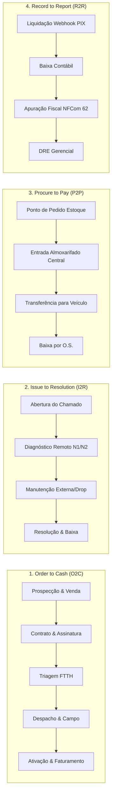

# Arquitetura de Processos, Governança de Papéis (RBAC) e Padrões Operacionais do ispERP
**Status:** Oficial / Aprovado  
**Padrões de Referência:** BPM CBOK (ABPMP), BPMN 2.0 (OMG), eTOM (TM Forum), ISO 9001  
**Escopo:** Gestão de Processos End-to-End, Visibilidade Unificada, Segregação de Atribuições e POPs Embarcados  

---

## 1. Visão Geral e Princípios Norteadores

O ispERP adota uma **Arquitetura Orientada a Processos e Eventos (Event-Driven & Process-Centric Architecture)**, superando o modelo tradicional de cadastros estáticos e silos departamentais. 

### Princípios Fundamentais:
1. **Visibilidade Universal (Transparência Operacional):** Qualquer colaborador autorizado pode consultar em qual etapa um atendimento, contrato ou ordem de serviço se encontra, eliminando cobranças redundantes em canais externos.
2. **Atribuição Estrita (Segregação de Funções & RBAC):** A capacidade de executar ações operacionais que provocam transições de estado é estritamente vinculada ao perfil de acesso (Role) competente.
3. **Instruções Operacionais Embarcadas (POP & IT Vivos):** As regras, checklists e critérios de qualidade são acessíveis diretamente no ponto de execução da interface, eliminando o isolamento de manuais estáticos.
4. **Rastreabilidade e Integridade Forense:** Toda transição de estado, despacho ou fechamento é auditada imutavelmente com carimbo de data/hora, identificação do operador e payload contextual (`audit_logs`).

---

## 2. Estrutura Canônica dos Macroprocessos

O ispERP estrutura as operações do provedor de internet em 4 macroprocessos globais de ponta a ponta:

---

## 3. Matriz de Governança e Papéis (RACI & RBAC)

A segregação operacional do ispERP define responsabilidades claras para cada etapa:

- **R (Responsible):** Executor direto da etapa.
- **A (Accountable):** Responde pela integridade e conclusão da entrega.
- **C (Consulted):** Provê apoio técnico, dados ou validação.
- **I (Informed):** Notificado do progresso e transições de status.

### 3.1. Matriz do Macroprocesso de Instalação e Ativação FTTH:

| Etapa | Perfil Responsável (R) | Entradas (Input) | Saídas (Output) | Perfil Consultado (C) | Perfis Informados (I) |
| :--- | :--- | :--- | :--- | :--- | :--- |
| **1. Venda & Onboarding** | `SALES` | Proposta comercial, dados do cliente e plano | Contrato gerado | Suporte N1 (viabilidade) | Financeiro |
| **2. Formalização / Assinatura** | `CUSTOMER` / `SALES` | Contrato em PDF, link de assinatura ou PIN | Contrato assinado | Jurídico / Admin | Torre de Controle |
| **3. Triagem de Materiais** | `SUPPORT_ANALYST` / `SUPPORT_N2` | Contrato formalizado e endereço do assinante | Demanda calculada (drop, ONU, CTO) | Almoxarife Central | Vendedor |
| **4. Despacho & Agendamento** | `SUPPORT_ANALYST` / `ADMIN` | Fila de demandas validadas e ranking GPS | O.S. agendada e insumos alocados | Técnico de Campo | Assinante, Vendedor |
| **5. Instalação em Campo** | `TECHNICIAN` | O.S. despachada e insumos no veículo | Drop ancorado, ONU instalada e foto de potência | Suporte N2 | Torre de Controle |
| **6. Ativação & Encerramento** | `SYSTEM` / `SUPPORT_N2` | Serial da ONU e confirmação de sinal | Cliente navegando na OLT e O.S. encerrada | Técnico de Campo | Financeiro, Vendedor |

---

## 4. O Componente de Interface: Stepper Visual de Processo

A interface do usuário do ispERP (Flutter Desktop / Web / Mobile) adota o componente visual `ProcessLifecycleStepper`:

1. **Visão de Linha do Tempo:**
   - Renderiza horizontalmente (ou verticalmente em telas compactas) todas as etapas do ciclo.
   - Etapas concluídas recebem ícone verde `check_circle`.
   - A etapa ativa destaca o responsável atual e o tempo decorrido no estágio.
   - Etapas futuras permanecem em tom neutro, demonstrando a previsibilidade da entrega.
2. **Adaptação Defensiva por Perfil Logado:**
   - **Se o usuário logado possui a role da etapa ativa:** Ações primárias de avanço e formulários contextuais são habilitados.
   - **Se o usuário logado for de outro departamento:** As ações são desabilitadas e substituídas por etiquetas informativas de transparência (*"Em atendimento por [Nome do Colaborador] no setor [Setor]"*).
3. **Guia Operacional (POP) Integrado:**
   - Acesso com um clique a orientações diretas de boas práticas operacionais, sem necessidade de consulta a fontes externas.

---

## 5. Próximos Passos de Execução

1. **Implementação do Componente Flutter:** Criar `ProcessLifecycleStepperWidget` em `lib/core/widgets/` com suporte a temas, responsividade e layout anti-overflow.
2. **Integração na Ordem de Serviço & Torre de Controle:** Plugar o componente na visualização de detalhes da O.S. (`DispatchControlTowerScreen`).
3. **Mapeamento Formal em BPMN 2.0:** Adicionar os arquivos XML/BPMN abertos em `docs/processos_bpmn/`.
