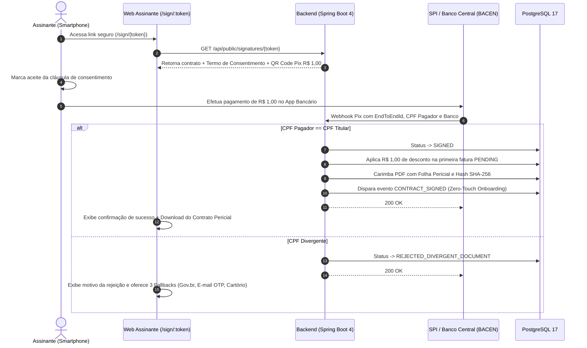

# Especificação Técnica Oficial: Assinatura Eletrônica Baseada em Autenticação Pix

> **Fundamentação Jurídica:** Medida Provisória nº 2.200-2/2001 (Art. 10, § 2º) e Lei Federal nº 14.063/2020 (Art. 4º, II - Assinatura Eletrônica Avançada).  
> **Status:** Implementado, Validado com Testcontainers (PostgreSQL 17) e em Produção (Milestone 32).

---

## 1. Visão Geral & Propósito

O módulo de Assinatura Eletrônica via Pix do ispERP substitui plataformas externas caras (Clicksign, DocuSign, ZapSign) por um mecanismo nativo de autenticação bancária instantânea de valor simbólico (R$ 1,00).

### Os 3 Pilares de Blindagem:
1. **Autenticação Biométrica e KYC Nível 3**: O signatário utiliza a conta corrente pessoal que já passou por checagem documental e biometria no Banco Central.
2. **Bloqueio Inflexível de Divergência de CPF**: Se o Pix for emitido de uma conta de terceiro (cônjuge, parente, amigo), o ERP rejeita a assinatura, impedindo que colaboradores cadastrem contratos fraudulentos em nome de terceiros.
3. **Custo Zero Real para o Cliente**: O valor de R$ 1,00 pago na autenticação é abatido automaticamente como desconto na primeira mensalidade do contrato.

---

## 2. Fluxo Operacional Ponta a Ponta

---

## 3. Folha Pericial Forense (Certificado de Autenticidade Digital)

Todo contrato assinado recebe uma folha anexa que consolida as evidências probatórias aceitas pela jurisprudência brasileira:
- **Identificador E2E do BACEN**: Código irrevogável da liquidação no Sistema de Pagamentos Instantâneos.
- **Hash SHA-256**: Prova matemática de que nenhuma vírgula do contrato foi alterada após o pagamento.
- **Identificação da Instituição Bancária**: Nome do banco e código ISPB.
- **Dados de Conexão**: Endereço IP do cliente, Navegador / User-Agent e carimbo de data/hora no fuso de Brasília.
- **Declaração de Consentimento Expresso**: Enquadramento formal nos diplomas da MP 2.200-2/01 e Lei 14.063/2020.

---

## 4. Rotas Oficiais de Fallback

Caso o titular não disponha de conta bancária com chave Pix ativa em seu próprio CPF, o ERP permite selecionar formalmente:
1. **Gov.br**: Assinatura digital via autenticação única do Governo Federal (nível Prata ou Ouro).
2. **E-mail OTP**: Envio de link protegido por código token temporário no e-mail do titular.
3. **Presencial / Cartório**: Emissão de minuta impressa para assinatura física na recepção do provedor ou firma reconhecida em cartório.
