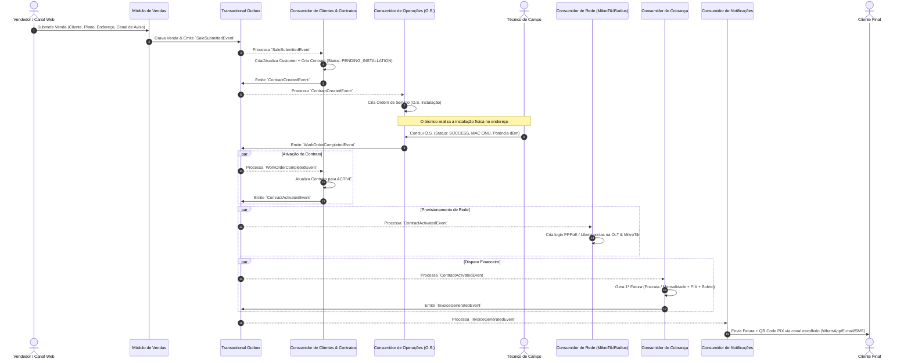
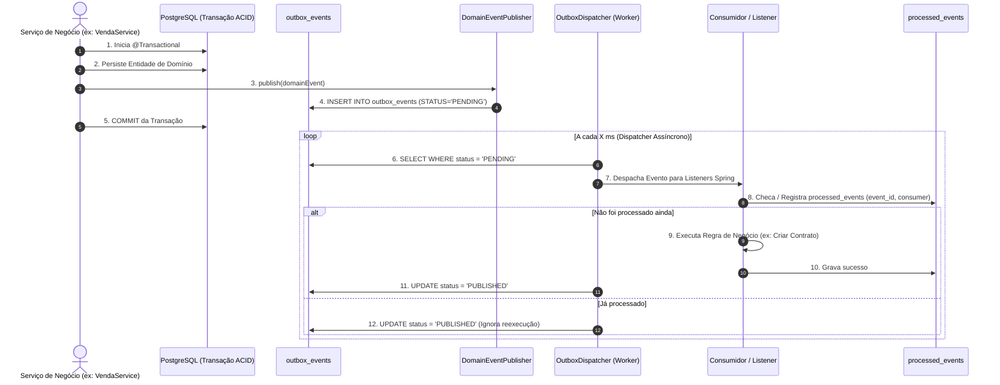

# Fluxo Orientado a Eventos (Event-Driven Workflow: Venda -> Ativação -> Cobrança)

Este documento detalha o ciclo de vida operacional 100% automatizado por eventos no **ispERP**, desde a conclusão da venda até a entrega da primeira fatura multicanal para o assinante.

---

## 1. Diagrama de Sequência de Eventos



---

## 1.1. Ciclo de Vida do Transactional Outbox & Idempotência

O diagrama abaixo ilustra o comportamento do mecanismo de Outbox e Idempotência que sustenta cada um dos passos do fluxo operacional:



---

## 2. Catálogo Detalhado de Eventos

### 2.1. `SaleSubmittedEvent`
Disparado quando a proposta comercial é aceita e submetida.
- **Payload:**
```json
{
  "eventId": "01918a22-35b1-7000-8000-a00000000001",
  "eventType": "SALE_SUBMITTED",
  "timestamp": "2026-08-28T21:30:00Z",
  "data": {
    "saleId": "01918a22-35b1-7000-8000-a00000000002",
    "customer": {
      "name": "Maria Oliveira",
      "cpf": "12345678901",
      "email": "maria@email.com",
      "phone": "11987654321"
    },
    "installationAddress": {
      "street": "Av. Brasil",
      "number": "1500",
      "neighborhood": "Centro",
      "city": "São Paulo",
      "state": "SP",
      "zipCode": "01000-000",
      "latitude": -23.55052,
      "longitude": -46.633308
    },
    "planId": "01918a22-35b1-7000-8000-a00000000003",
    "preferredDueDate": 10,
    "notificationChannel": "WHATSAPP"
  }
}
```

### 2.2. `ContractCreatedEvent`
Disparado após o consumidor criar o registro do cliente e o contrato em estado `PENDING_INSTALLATION`.
- **Efeito:** Notifica a equipe de campo e gera a fila de agendamento de O.S.

### 2.3. `WorkOrderCompletedEvent`
Disparado quando o técnico finaliza o serviço de campo no app mobile/web.
- **Campos Importantes:** `workOrderId`, `contractId`, `status: SUCCESS`, `equipmentMac`, `onuSerial`, `fiberSignalDbm`.

### 2.4. `ContractActivatedEvent`
Disparado quando o contrato é promovido de `PENDING_INSTALLATION` para `ACTIVE`.
- **Efeitos em Paralelo:**
  1. **Rede:** Cria usuário e senha PPPoE no MikroTik/Radius com o profile de velocidade correspondente.
  2. **Billing:** Inicia o ciclo de faturamento e emite a primeira cobrança proporcional ou cheia.

### 2.5. `InvoiceGeneratedEvent`
Disparado quando a fatura é calculada e os dados de pagamento (Chave PIX Copia-e-Cola, Link de Boleto) estão disponíveis.
- **Efeito:** Consumidor de Notificações monta a mensagem personalizada e envia via WhatsApp/E-mail.

---

## 3. Resiliência, Falhas & Idempotência

### 3.1. Idempotência Obrigatória
Como eventos podem ser retransmitidos em caso de oscilações de rede, cada consumidor armazena o `event_id` na tabela `processed_events`.
- Se o `event_id` já existir, o processamento é ignorado com log informativo.

### 3.2. Tratamento de Falhas (Dead Letter Queue & Sagas)
- **Falha no Provisionamento de Rede:**
  - O sistema tenta até 3 vezes com *exponential backoff*.
  - Se persistir, o contrato permanece `ACTIVE_PENDING_NETWORK_SYNC` e um alerta de alta prioridade é enviado ao NOC sem travar a fatura.
- **Falha no Envio de Notificação (ex: API do WhatsApp fora do ar):**
  - O evento é colocado em fila de retentativa e um canal alternativo (E-mail/SMS) é acionado por contingência.
