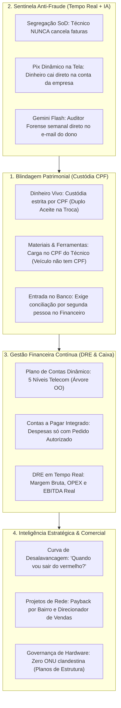

# Diretriz Oficial: Gestão Financeira Contínua, Blindagem Patrimonial & Sentinela Anti-Fraude

> **Status:** Documento Oficial Consolidado  
> **Data:** 2026-09-02  
> **Origem:** Consolidação das versões v1 a v5 de Brainstorming  
> **Público-Alvo:** Engenharia de Software, Arquitetura, Contabilidade e Operações ispERP  

---

## 1. Visão Geral & Princípio Norteador

O **ispERP** redefine a gestão de Provedores de Internet ao romper com a passividade dos ERPs tradicionais de telecomunicações. O sistema adota a filosofia de **Segurança, Blindagem Patrimonial e Transparência por Design (*Anti-Fraud & Financial Health by Design*)**.

O software não é apenas um emissor de cobranças ou autenticador de rede: ele atua como o **CFO e Auditor Virtual do Proprietário**, garantindo que:
1. **Nenhum centavo e nenhum equipamento fique sem um CPF formalmente responsável.**
2. **O caixa seja rastreado ponta a ponta** (do bolso do cliente até o extrato bancário com dupla checagem).
3. **O empresário tenha clareza matemática do seu DRE, EBITDA e da data exata de saída do vermelho** frente às suas dívidas e parcelamentos.
4. **As campanhas comerciais sejam guiadas pelo retorno do investimento de rede (Payback por Projeto de Bairro)**.

---

## 2. Pilares de Blindagem Operacional & Anti-Fraude

### 2.1. Custódia Material 100% no CPF (Fim do Conceito de "Estoque Móvel")
- **Fundamento:** Veículos são bens inanimados; apenas pessoas físicas (CPF) e jurídicas (CNPJ) possuem responsabilidade civil, criminal e trabalhista.
- **Regra:** Todo item retirado do almoxarifado (ONTs, bobinas de drop, conectores, máquinas de fusão, OTDR) é transferido como **Carga Patrimonial para o CPF do Colaborador** (`user_material_custody`).
- **Troca de Carro:** A responsabilidade dos materiais acompanha o CPF do técnico, independentemente da viatura utilizada.
- **Transferência em Campo:** Se um técnico repassar materiais para outro na rua, o sistema exige que o recebedor confira as quantidades/seriais e clique em `[ Confirmar Recebimento de Carga ]`.

### 2.2. Ciclo Estrito de Dinheiro Vivo: Do Cliente ao Banco
O dinheiro em espécie percorre uma cadeia de custódia ininterrupta:
1. **No Cliente:** O técnico recebe o valor (ex: taxa de instalação de R$ 300) e seleciona `[ Recebido em Espécie ]`. O recibo timbrado oficial com QR Code é emitido, e o valor é debitado na **Conta de Custódia do CPF do Técnico**.
2. **Na Sede (Passagem de Caixa):** O técnico entrega as cédulas à atendente do caixa central. Ela abre a tela de custódia, conta o dinheiro e clica em `[ Confirmar Recebimento ]`. A dívida do técnico é zerada e passa para o **CPF da Atendente**.
3. **Na Gaveta / Troca de Turno:** Se a atendente sair para almoço ou encerrar o expediente, a transferência de gaveta exige que a substituta conte o dinheiro físico e confirme no sistema.
4. **No Banco (Depósito Real):** Estar no cofre da empresa **não é estar no banco**. A custódia só é zerada quando o colaborador faz o depósito bancário, anexa o comprovante digitalizado, e **uma segunda pessoa do financeiro/CFO confere o extrato bancário real e aprova a baixa**.
5. **Pagamento de Despesas em Espécie:** Só é permitido se houver um **Pedido de Compra previamente aprovado pelo gestor** com cupom/nota fiscal anexada.

### 2.3. Segregação de Funções (SoD) & Sentinela IA
- **Regra de Permissão Rígida:** Colaboradores de campo e vendedores têm permissão de recebimento, mas **ZERO permissão de cancelamento, estorno ou concessão de descontos**. Cancelamentos exigem Dupla Autorização de um Gestor Financeiro.
- **Sentinela Anti-Fraude com Gemini Flash:**
  - O backend monitora padrões atípicos (alto volume de dinheiro vivo em comparação à média da empresa, cancelamentos fora do horário, títulos cancelados com recibo já emitido).
  - Emite alerta vermelho imediato em caso de tentativa de fraude flagrante.
  - Gera semanalmente/mensalmente um **Dossiê Executivo compactado** via Gemini Flash diretamente para o e-mail/WhatsApp do proprietário com custo de poucos centavos.

### 2.4. Governança Físico-Lógica de Hardware (Zero ONU Clandestina)
- Nenhuma ONU pode estar provisionada na OLT ou autenticada no FreeRADIUS sem um contrato ativo correspondente.
- Equipamentos internos do provedor (câmeras de segurança, enlaces de POP, roteadores de monitoramento) utilizam a modalidade **Contrato de Estrutura Interna** (custo R$ 0,00 ou operacional interno).
- No modo migração, equipamentos importados sem cadastro caem no **Relatório de ONUs Órfãs** para vinculação ou desprovisionamento imediato.

### 2.5. Prevenção de Serviços "Por Fora" (Caixa 2 Clandestino) & Esteira de Isenção de Taxas de O.S.
- **O Desvio Tradicional:** O colaborador negocia diretamente com o cliente (mudança de endereço, ponto adicional, reparo de fibra) e cobra R$ 50 a R$ 150 em dinheiro ou Pix pessoal, sem registrar nada no sistema, gerando custo de frota, técnico e insumos para o provedor.
- **Tríplice Blindagem Sistêmica:**
  1. **Trava Física na OLT:** A ONU não navega na nova CTO/Porta PON sem que uma O.S. oficial autorize a migração no ispERP. O técnico não tem senha de acesso root aos equipamentos de rede.
  2. **Balanço Semanal de Materiais por CPF:** O consumo de drop e conectores é amarrado à carga patrimonial do técnico. Insumos faltantes sem O.S. correspondente geram cobrança imediata na prestação de contas do colaborador.
  3. **Esteira de Isenção de Taxas com Alçada Gerencial & Notificação Anti-Fraude:**
     - **Toda O.S. tarifável tem taxa padrão de tabela** (ex: Mudança de Endereço R$ 100,00).
     - O atendente **não tem permissão de zerar valores**. Se o cliente ameaçar cancelamento para reter o contrato, o atendente marca `Solicitar Isenção de Taxa` com justificativa comercial obrigatória.
     - A pendência cai na fila do **Gestor Administrativo/CFO**, que avalia o LTV/histórico e decide.
     - **O Escudo do Cliente (Transparência Radical):** Ao aprovar a isenção, o sistema dispara imediatamente uma mensagem oficial por WhatsApp/E-mail ao cliente:
       > *"Olá, {{nome}}! Informamos que a taxa de R$ 100,00 referente à sua Mudança de Endereço foi **100% ISENTADA** pelo nosso gestor {{gestor_nome}} em agradecimento à sua fidelidade. ⚠️ **AVISO IMPORTANTE:** Este serviço é totalmente gratuito. Nenhum técnico ou colaborador está autorizado a cobrar qualquer valor no ato da visita."*
     - Se o técnico tentar cobrar o cliente em campo, o próprio cliente o desmascara exibindo o comunicado oficial da diretoria.

---

## 3. Gestão Financeira Contínua, DRE & Curva de Desalavancagem

### 3.1. Plano de Contas Dinâmico e Hierárquico (Árvore Orientada a Objetos)
O plano de contas é flexível, modelado como uma árvore auto-referenciada (`ChartOfAccount`), permitindo personalização total por contadores e consultores externos, já nascendo com o **Template Padrão Canônico de Telecomunicações** em 5 níveis:
- **`01. RECEITAS`:** SCM (Varejo, PME, Governo), SVA, Instalações, Serviços ISS, Venda de Equipamentos, Entradas Financeiras.
- **`02. IMPOSTOS SOBRE RECEITA`:** Simples Nacional, PIS, COFINS, IRPJ, CSLL, ISS.
- **`03. INTERCONEXÃO & TRANSPORTE`:** Link Trânsito IP, Transporte de Dados, PTT.
- **`04. CUSTOS FIXOS & OPEX`:** Folha, Benefícios, Comissões, Frota/Combustível, Aluguel de Torres, **Compartilhamento de Postes Concessionária**, Tarifas Bancárias, FUST, FUNTTEL, Marketing.
- **`05. INVESTIMENTOS & CAPEX`:** Veículos, Máquinas de Fusão/OTDR, Construção de Rede de Fibra, Data Center e Materiais de Instalação de Clientes.

### 3.2. DRE Gerencial em Tempo Real
Geração automática da Demonstração do Resultado por competência e caixa:
$$\text{Receita Bruta} - \text{Deduções/Impostos} = \text{Receita Líquida}$$
$$\text{Receita Líquida} - \text{Custos dos Serviços (Interconexão)} = \text{Lucro Bruto}$$
$$\text{Lucro Bruto} - \text{OPEX (RH, Frota, Postes, Marketing)} = \mathbf{EBITDA}$$
$$\mathbf{EBITDA} - \text{Depreciação/Amortização} - \text{Despesas Financeiras} = \mathbf{Lucro\ Líquido}$$

### 3.3. O Motor de Desalavancagem ("Saída do Vermelho")
O sistema cruza o MRR projetado (vendas líquidas menos churn e inadimplência real) com os custos fixos e a esteira de parcelamentos ativos de investimentos (CAPEX no Grupo 05).
- **Indicadores Apresentados ao Dono:**
  1. **Mês do Fundo do Poço:** Identifica o mês de menor saldo de caixa para evitar crises de liquidez.
  2. **Data da Virada (Alforria Financeira):** O mês exato em que a última parcela de financiamento é quitada e o caixa entra em expansão líquida livre.
  3. **Simulador "E Se...?":** Ferramenta interativa onde o gestor simula novas compras parceladas (ex: mais 50km de fibra em 10x) e visualiza na hora o impacto na saúde do caixa antes de assinar a compra.

---

## 4. Gestão de CAC Real e Payback por Projeto de Rede

### 4.1. Realidade do CAC
A taxa de ativação paga pelo cliente não quita o custo total de entrada:
- Custo Real = ONT + Drop + Conectores + PTO + Mão de Obra + Viagem/Combustível (~R$ 540 a R$ 650).
- O saldo remanescente é diluído ao longo das primeiras mensalidades.

### 4.2. Módulo de Projetos de Rede (Centro de Custo Topológico & Mapa de Guerra)
- Toda expansão é cadastrada como um **Projeto de Rede** (ex: *"Expansão Bairro Novo"*).
- Todas as despesas de implantação daquela rota (cabos, caixas de emenda, terceirizados, aumento de postes, panfletagem) são debitadas ao Projeto.
- As CTOs daquela área são associadas ao Projeto. Toda receita (ativações e mensalidades) daqueles clientes credita o retorno daquele Projeto.
- **Direcionador Comercial:** O sistema destaca no mapa os projetos onde o investimento ainda não retornou e onde há portas de CTO ociosas, direcionando as forças de vendas para onde o retorno do capital será maximizado.

---

## 5. Diretrizes de Design de Interface (UI/UX)

Para afastar completamente a sensação de "templates genéricos de IA", o frontend do módulo financeiro seguirá princípios de **Software Corporativo Moderno de Alta Densidade**:

1. **Minimalismo Funcional (Zero Encheção de Linguiça):**
   - Se um elemento não tem utilidade operacional imediata, ele não estará na tela.
   - Nada de gráficos ilustrativos vazios ou cards decorativos sem dados acionáveis.
2. **Alta Densidade de Informação & Legibilidade:**
   - Tabelas financeiras limpas com alinhamento numérico impecável à direita, fontes monoespaçadas para valores monetários (`tabular-nums`), tags de status com contraste elegante e badges semafóricos discretos (verde, âmbar, vermelho).
3. **Fluxos Passo a Passo com Feedback Imediato:**
   - Passagem de custódia e conferência bancária estruturadas em wizards objetivos de 2 cliques:
     *Passo 1: Conferir cédulas/comprovante ➔ Passo 2: Confirmar com senha/token.*
4. **Cockpit Executivo Direto ao Ponto:**
   - Tela do dono com foco em 3 números sagrados: **EBITDA Atual**, **Ponto do Fundo do Poço** e **Data Projetada de Saída do Vermelho**, acompanhados do gráfico linear da curva de caixa dos próximos 24 meses.

---

## 6. Relação de Entidades a Implementar (Backend)

| Entidade JPA | Descrição |
| :--- | :--- |
| `ChartOfAccount` | Plano de contas em árvore auto-referenciada com código contábil, tipo e vínculo DRE. |
| `UserCashCustody` | Registro contábil de custódia de dinheiro vivo vinculado ao CPF do colaborador. |
| `CashTransferLog` | Histórico imutável de transferências de dinheiro entre CPFs com status e duplo aceite. |
| `BankDepositConfirmation` | Depósito bancário com anexo de comprovante e aprovação de conciliação por segunda pessoa. |
| `UserMaterialCustody` | Carga patrimonial de equipamentos e insumos em campo vinculada ao CPF do técnico. |
| `PayableInvoice` | Título de contas a pagar com rateio por plano de contas e centro de custo/projeto. |
| `ExpenseInstallment` | Parcelas individuais de dívidas e parcelamentos com datas de vencimento e juros. |
| `NetworkProject` | Projeto de expansão de rede com centro de custo, topologia FTTH associada e métricas de ROI. |
