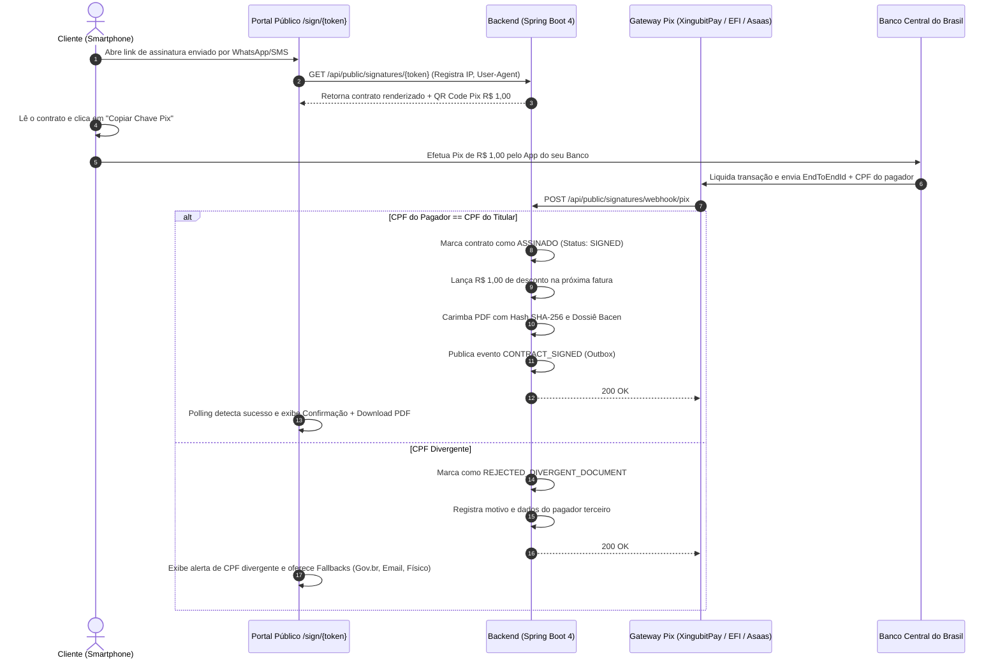

# Brainstorming & Arquitetura: Assinatura Eletrônica via Pix (MP 2.200-2/01 & Lei 14.063/2020) - v2

**Data:** 02/09/2026  
**Status:** Em Discussão / Planejamento Arquitetural (v2)  
**Tema:** Assinatura Eletrônica Avançada por Autenticação Bancária Instantânea (Pix R$ 1,00) com Batimento Estrito de CPF no BACEN, Desconto Automático na Fatura e Alternativas de Fallback.

---

## 1. Contexto & Fundamentação Jurídica

A contratação de internet banda larga e planos de fidelidade tradicionalmente sofre com:
1. **Fraudes de Vendas e Falsidade Ideológica**: Contratos gerados por colaboradores ou terceirizados em nome de terceiros (parentes, idosos) para bater metas comerciais.
2. **Custos Recorrentes de Plataformas Externas**: Plataformas como DocuSign, Clicksign e ZapSign cobram entre R$ 2,50 e R$ 6,00 por contrato assinado.
3. **Fricção do Assinante**: Solicitação de selfies, envio de fotos de CNH ou criação de contas em portais terceiros que geram abandono no funil de vendas.

### Enquadramento Legal
- **Art. 10, § 2º da Medida Provisória nº 2.200-2/2001**: Validade de assinaturas eletrônicas com comprovação de autoria e integridade aceita pelas partes.
- **Lei nº 14.063/2020 (Art. 4º, II)**: Classificação como **Assinatura Eletrônica Avançada**, pois:
  - Associa-se ao signatário de maneira unívoca (conta bancária individual com validação biométrica e KYC nível 3).
  - Utiliza dados para a criação da assinatura sob o controle exclusivo do titular (aplicativo do banco com senha/biometria).
  - Assegura que qualquer modificação posterior no contrato seja detectável (Hash SHA-256 do documento).

---

## 2. Decisões de Negócio Consolidadas (Rodada 1)

### Decisão 1: Tratamento de Divergência de CPF / CNPJ
- **Regra**: Se o CPF/CNPJ do pagador retornado pelo Banco Central no Pix for divergente do CPF/CNPJ cadastrado no titular do contrato, **o contrato NÃO é assinado** (`REJECTED_DIVERGENT_DOCUMENT`).
- **Comunicação ao Cliente**: A tela pública exibe alerta explícito:
  > *"Assinatura não concluída: O Pix foi recebido da conta de [Nome Mascarado], CPF [***.XXX.XXX-**], que difere do titular do contrato [Nome Titular], CPF [***.YYY.YYY-**]. O pagamento deve ser feito obrigatoriamente pela conta do titular."*
- **Alternativas de Fallback**: Caso o titular não possua conta bancária Pix ativa, o ERP disponibiliza e documenta 3 alternativas oficiais:
  1. **Assinatura por E-mail / OTP / Selfie**: Link seguro com token enviado ao e-mail cadastrado.
  2. **Assinatura via Gov.br**: Integração com autenticação da conta Gov.br (níveis Prata/Ouro).
  3. **Assinatura Física em Cartório / Presencial**: Geração do PDF com folha de assinatura para impressão e reconhecimento presencial na recepção do ISP ou em cartório.

### Decisão 2: Destino do Valor Simbólico (R$ 1,00)
- **Regra**: O valor de R$ 1,00 pago pelo cliente é **convertido automaticamente em desconto na próxima fatura**.
- **Mecanismo Contábil/Financeiro**:
  - Ao confirmar a assinatura via Pix, o ERP verifica se já existe fatura gerada com status `PENDING` para o contrato.
    - Se existir: aplica `discount_amount = discount_amount + 1.00`.
    - Se a fatura ainda não tiver sido gerada (onboarding/pré-instalação): grava um crédito de R$ 1,00 em `contract_credits` ou campo `pending_onboarding_credit` no contrato, para abater automaticamente no momento da emissão da primeira mensalidade.
- **Percepção do Assinante**: Custo zero real, transparência e confiança.

### Decisão 3: Carimbo Pericial & Dossiê de Autenticidade no PDF
- **Regra**: O PDF assinado conterá, ao final, uma **Folha de Rosto de Autenticidade Forense (Certificado de Assinatura)** contendo:
  - **Identificador Único do Pix (EndToEndId BACEN)**: Ex: `E00038166202609022345s0192837482`.
  - **Hash Criptográfico SHA-256**: Calculado sobre o texto integral e as cláusulas do contrato no momento da assinatura.
  - **Identificação do Signatário**: Nome completo, CPF, Banco Emissor e Código ISPB retornados pelo BACEN.
  - **Evidências Digitais de Acesso**: Endereço IP do cliente, Navegador / User-Agent, Data e Hora com milissegundos e Fuso Horário de Brasília (-03:00).
  - **Termo de Consentimento Expresso**: Texto legal citando expressamente a MP 2.200-2/01 e a Lei 14.063/2020.

---

## 3. Arquitetura Técnica & Fluxo de Integração

---

## 4. Próximos Passos de Modelagem e Implementação

1. **Modelo de Dados**:
   - Enriquecer `contract_signatures` com `fallback_method_selected`, `discount_invoice_id` e `onboarding_credit_applied`.
   - Criar suporte aos 3 modos de fallback caso o Pix seja rejeitado.
2. **Backend**:
   - `ElectronicSignatureService`: Integrar abatimento de R$ 1,00 na primeira fatura.
   - `ContractPdfRenderer`: Gerador de folha pericial elegante ao final do contrato.
3. **Frontend**:
   - Tela pública `/sign/:token`: Interface moderna com leitor do contrato, botão de copiar Pix, verificação em tempo real (polling), feedback de divergência e seletor de fallback.
4. **Testes**:
   - Testes unitários de batimento de CPF e desconto de R$ 1,00.
   - Teste de integração com Testcontainers PostgreSQL 17 validando webhook de sucesso e webhook de divergência.
