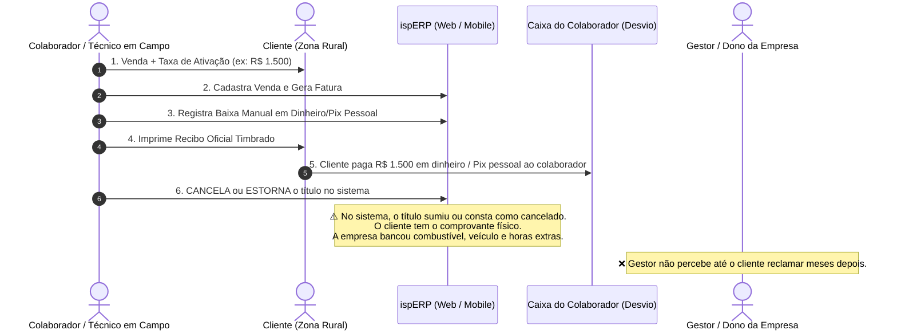
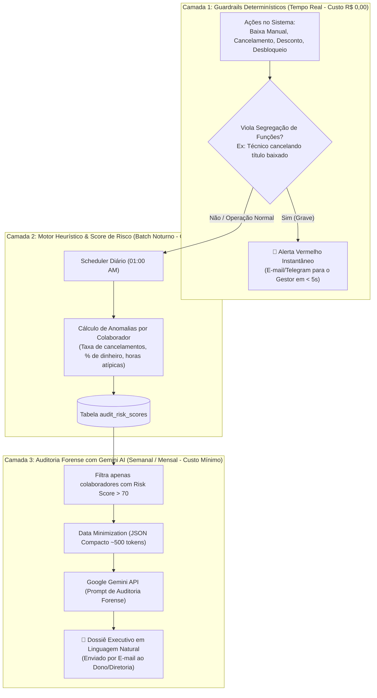

# Brainstorming & Arquitetura: Sentinela Anti-Fraude & Auditoria Comportamental (Audit Watchdog)

> **Status:** Rascunho Vivo / Em Discussão  
> **Data:** 2026-09-02  
> **Tema:** Detecção Automática de Fraudes Internas, Desvios de Conduta e Uso Inteligente da API Gemini com Otimização de Custos  
> **Gatilho de Negócio:** Caso real de desvio por técnicos/colaboradores em campo (Baixa Manual de Ativação/Mensalidade ➡️ Impressão de Recibo Oficial ➡️ Cancelamento Posterior do Título ➡️ Apropriação Indébita de Caixa).

---

## 1. O Problema Real: O "Ponto Cego" dos Gestores em Provedores

Provedores de internet operam com alta dispersão geográfica: dezenas de técnicos em viaturas na zona rural, atendentes em lojas físicas distintas, operadores de suporte em home office e vendedores externos.

### Anatomia do Golpe Relatado (Fraude da Baixa com Cancelamento Subsequente):


---

## 2. Visão Geral da Solução: Arquitetura Sentinela em 3 Camadas

Para não sobrecarregar a infraestrutura e **não gastar dinheiro desnecessário com chamadas de IA**, a observabilidade anti-fraude deve funcionar em um funil escalonado de 3 camadas:



---

## 3. Detalhamento das Camadas

### Camada 1: Guardrails Determinísticos & Segregação de Funções (SoD)
*Custo: R$ 0,00 | Tempo de Resposta: Imediato*

A primeira linha de defesa não precisa de IA; precisa de **regras de negócio invioláveis**:
1. **Segregação de Funções (Segregation of Duties - SoD):**
   - Usuário com perfil `TECNICO` ou `VENDEDOR` **não pode ter permissão de cancelar faturas**. Somente o perfil `FINANCEIRO_GESTOR` ou `ADMIN` pode cancelar.
   - Se o técnico registrar a baixa no ato da instalação, o título é marcado com a flag `settled_in_field = true`.
2. **Gatilho de Violação Imediata (Alerta Vermelho Instantâneo):**
   - Se qualquer usuário realizar a sequência: `Baixa Manual` ➡️ `Cancelamento do Título em até 30 dias`, o sistema dispara **imediatamente** um e-mail de alerta crítico para o gestor com o comprovante em anexo.
   - Se o usuário tentar estornar uma fatura que já teve recibo gerado, exige aprovação em duas etapas (*Dual Authorization*).

---

### Camada 2: Motor Heurístico Local & Score de Risco (Anti-Fraud Engine)
*Custo: R$ 0,00 | Execução: Cron Noturno às 01:00 AM*

O banco de dados já possui histórico de auditoria (`audit_logs`). O backend roda um worker diário que calcula indicadores de desvio padrão:

| Indicador de Risco | Como é Medido | Limiar de Alerta |
| :--- | :--- | :--- |
| **Taxa de Baixas em Dinheiro** | % de faturas baixadas em dinheiro pelo colaborador vs média geral da empresa (onde 90% dos clientes pagam em Pix/Boleto). | Colaborador com > 40% em dinheiro. |
| **Frequência de Cancelamentos** | Quantidade de títulos ou O.S. canceladas após terem sido agendadas ou visitadas. | 3x acima do desvio padrão da equipe. |
| **Descontos e Isenções Concedidas** | Total em reais concedido em descontos manuais sem prévia autorização de gerência. | Somatório > R$ 500/mês. |
| **Desbloqueios Manuais Recorrentes** | Liberação manual de sinal para o mesmo assinante inadimplente sem registro de pagamento no banco. | > 2 vezes para o mesmo cliente. |
| **Atividades em Horários Atípicos** | Baixas financeiras e cancelamentos realizados de madrugada ou finais de semana sem O.S. aberta. | Ocorrências entre 22h e 06h. |

Cada colaborador recebe um **Score de Risco (0 a 100)**:
- `0 a 30`: Risco Baixo (Padrão normal da operação).
- `31 a 70`: Risco Moderado (Acompanhamento em painel interno).
- `71 a 100`: **Risco Crítico** (Candidato prioritário para auditoria da IA).

---

### Camada 3: Auditoria Forense com Gemini API (Ultra-Econômica)
*Custo: Centavos de Real por Mês | Frequência: Semanal ou Mensal (ou sob demanda)*

Para evitar consumo desnecessário de tokens:
1. **Data Minimization:** O sistema **NÃO** envia logs brutos do servidor para a API do Gemini. Ele envia apenas um JSON resumido com as anomalias consolidadas dos colaboradores que atingiram pontuação crítica (`Risk Score > 70`).
2. **Exemplo de Payload Compacto enviado ao Gemini (~400 tokens):**
   ```json
   {
     "empresa": "Provedor Fibra X",
     "periodo": "Agosto/2026",
     "colaborador_suspeito": {
       "nome": "Carlos Técnico",
       "cargo": "Técnico de Instalação",
       "total_atendimentos": 42,
       "anomalias_detectadas": [
         { "tipo": "BAIXA_MANUAL_SEGUIDA_DE_CANCELAMENTO", "qtd": 6, "valor_total": 4800.00 },
         { "tipo": "PAGAMENTO_DINHEIRO_ACIMA_DA_MEDIA", "percentual": "68%", "media_empresa": "8%" },
         { "tipo": "CANCELAMENTO_TITULO_COM_RECIBO_IMPRESSO", "qtd": 5 }
       ]
     }
   }
   ```
3. **Papel da IA (Auditor Forense Sênior):**
   - A IA contextualiza os dados e gera um parecer executivo que o dono da empresa consegue ler em 30 segundos no celular, sem precisar decifrar relatórios de banco de dados.

---

## 4. Exemplo Real do E-mail Enviado ao Gestor

```markdown
Assunto: 🚨 ALERTA CRÍTICO FINANCEIRO: Comportamento Suspeito Detectado (Carlos Técnico)

Prezado Gestor,

O Sentinela Anti-Fraude do ispERP identificou um padrão de alto risco financeiro nas atividades do colaborador Carlos Técnico durante o mês de Agosto/2026.

📊 Resumo Executivo da Auditoria:
- Potencial Desvio Financeiro Detectado: R$ 4.800,00
- Nível de Risco: CRÍTICO (Score 94/100)
- Padrão Identificado: Emissão de recibos de ativação com posterior cancelamento de títulos.

🔍 Evidências Levantadas pelo Sistema:
1. Em 5 ocasiões distintas, o colaborador registrou baixa manual em dinheiro para taxas de instalação (média de R$ 960,00 por cliente na Zona Rural), emitiu o recibo timbrado e, entre 2 e 5 dias depois, realizou o cancelamento das faturas alegando "erro de lançamento".
2. O colaborador apresenta 68% de seus recebimentos em dinheiro vivo, enquanto a média de toda a equipe técnica é de apenas 8%.
3. Foram identificados 3 clientes ativos no FreeRADIUS cujos títulos de ativação constam como cancelados no financeiro.

💡 Ações Imediatas Recomendadas:
- Contatar os clientes da lista anexa para confirmação da forma e comprovante de pagamento.
- Revogar imediatamente a permissão de cancelamento de faturas do colaborador.
- Realizar auditoria física do inventário de equipamentos instalados nestas 5 ordens de serviço.

[ Baixar Dossiê Completo em PDF ]  |  [ Acessar Painel de Auditoria no ispERP ]
```

---

## 5. Próximos Passos para Discussão com o Usuário

- [ ] Aprovar a política de **Segregação de Funções (SoD)**: Técnicos não podem cancelar títulos de forma autônoma.
- [ ] Definir canais de notificação para alertas críticos: E-mail direto do gestor, WhatsApp corporativo da diretoria e/ou Telegram Bot.
- [ ] Estabelecer a periodicidade do relatório gerado pelo Gemini: Alerta vermelho imediato em caso de cancelamento suspeito + Consolidação executiva mensal.
