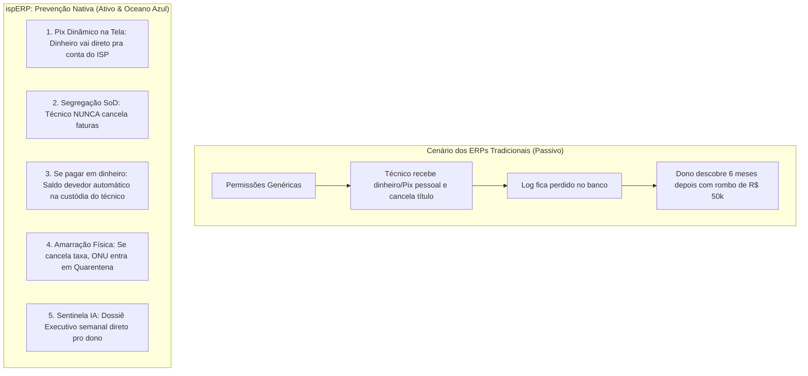

# Sentinela Anti-Fraude v2: Prevenção Nativa, Blindagem Patrimonial & Oceano Azul

> **Status:** Rascunho Vivo / Em Discussão  
> **Data:** 2026-09-02  
> **Versão:** v2 (Evolução da v1)  
> **Tema:** Princípios de Design Anti-Fraude (Security by Design), Travas de Prevenção Ativa, Eliminação do Pix Pessoal e Posicionamento de Mercado "Oceano Azul".  

---

## 1. A Filosofia "Security & Anti-Fraud by Design"

A maioria dos ERPs de telecomunicações do mercado foca apenas em *registrar* o que o usuário fez. Eles são passivos. Se um colaborador mal-intencionado faz algo ilícito, o sistema registra discretamente em um log enterrado em tabelas que nenhum dono tem tempo de auditar.

No **ispERP**, a premissa é inversa: **a arquitetura do sistema deve tornar o desvio estruturalmente impossível ou inviável de ser executado**, agindo ativamente antes que o prejuízo aconteça.

---

## 2. As 5 Travas de Prevenção Ativa (Mitigação na Raiz)

### Trava 1: Eliminação do Pix Pessoal do Técnico (Pix Dinâmico Instantâneo no App)
- **Como ocorria a fraude:** O técnico dizia ao cliente rural: *"Minha máquina tá sem sinal, faz um Pix no meu CPF que eu dou baixa aqui na hora"*.
- **Como o ispERP impede:**
  - O aplicativo do técnico (Mobile Web PWA) gera na tela o **QR Code Pix Dinâmico oficial do provedor** (via Xingubit Pay / Efí / Asaas).
  - O cliente aponta a câmera do celular dele para o celular do técnico e paga. O favorecido que aparece no banco do cliente é a **Razão Social do Provedor**.
  - A confirmação cai por Webhook em **< 2 segundos** no backend, gerando a baixa automática sem que o técnico tenha qualquer contato com a chave bancária ou possa intermediar valores.

### Trava 2: Conta Corrente de Custódia em Campo (Se o Cliente Pagar em Dinheiro Vivo)
- **Cenário:** Em fazendas distantes, o cliente só tem dinheiro em espécie.
- **A Regra Inviolável do ispERP:**
  - Se o técnico selecionar a opção `[ Receber em Espécie no Local ]`:
    1. O sistema emite o recibo para o cliente com status `RECEBIDO EM CAMPO PELO TÉCNICO`.
    2. Automaticamente, o valor (ex: R$ 1.500,00) é lançado na **Conta Corrente de Custódia do Colaborador** (`technician_cash_custody`).
    3. O colaborador fica com **saldo devedor ativo perante a tesouraria**.
    4. Ele só pode fechar o dia ou receber novas O.S. de instalação se fizer a prestação de contas (depósito/PIX do valor exato na conta da empresa ou entrega do envelope lacrado ao caixa central com conferência em 2 etapas).

### Trava 3: Princípio da Segregação de Funções (SoD) & Proibição de Cancelamento
- **Regra de Permissão Rígida:**
  - Usuários com perfil `TECNICO`, `VENDEDOR` ou `SUPORTE_CAMPO` têm permissão estrita de **LEITURA, RECEBIMENTO e EMISSÃO**, mas têm **PROIBIÇÃO TOTAL de CANCELAMENTO, ESTORNO ou CONCESSÃO DE DESCONTOS**.
  - Se um título foi baixado e houve erro de digitação real, o cancelamento exige **Dupla Autorização (Dual Authorization)** com a senha/biometria de um Gestor Financeiro formalmente cadastrado.

### Trava 4: Validação Pública de Recibos por Hash e QR Code
- Todo recibo gerado pelo ispERP (PDF ou térmico de 80mm) carrega:
  - Um **QR Code de Autenticidade Pública** apontando para `https://meuprovedor.com.br/recibo/{token}`.
  - Se o financeiro da empresa de fato cancelar um título fraudulento no futuro, a página pública passa a exibir em vermelho vivo:  
    `⚠️ AVISO: Este recibo foi CANCELADO em DD/MM/AAAA. Se você efetuou este pagamento a um colaborador, contate imediatamente a diretoria.`
  - Isso desencoraja qualquer colaborador de tentar falsificar ou cancelar recibos timbrados.

### Trava 5: Amarração Cruzada Inviolável (Rede vs Financeiro)
- O orquestrador de eventos (EDA) monitora a coerência entre hardware e faturamento:
  - Se um contrato foi ativado com taxa de instalação acordada, e por alguma via essa taxa de instalação for **cancelada ou zerada sem um "Termo de Isenção/Cortesía" assinado pela diretoria**, o sistema dispara:
    - Um alerta imediato no painel do NOC.
    - O contrato entra em status `FINANCIAL_AUDIT_REQUIRED`.
    - A ONU não é bloqueada de forma abrupta para não constranger o cliente se ele for inocente, mas a equipe de campo não pode realizar novas visitas sem liberação da auditoria.

---

## 3. O "Oceano Azul" Comercial do ispERP

### A Dor Oculta de Todo Dono de Provedor:
Todo proprietário de ISP já sofreu ou morre de medo de:
1. Técnico vendendo e recebendo por fora (instalação clandestina).
2. Técnico prestando serviços particulares com o carro, combustível e equipamentos da empresa.
3. Desvios em dinheiro vivo no balcão e em campo.
4. Perder processos na Justiça do Trabalho por falta de registros imutáveis de jornada e auditoria de ações.

### O Posicionamento Revolucionário:
Enquanto os concorrentes vendem apenas "emissão de boleto e controle de banda", o **ispERP** se posiciona como:
> **"O ERP com Blindagem Patrimonial Ativa e Sentinela Anti-Fraude com IA."**

Isso muda a percepção de valor: o software deixa de ser um "custo operacional" e passa a ser uma **ferramenta de proteção do lucro e do patrimônio**.

---

## 4. Matriz de Implementação dos Requisitos

| Módulo / Trava | Tipo de Proteção | Complexidade | Benefício Imediato |
| :--- | :--- | :--- | :--- |
| **Pix Dinâmico PWA em Campo** | Preventivo (Evita o golpe) | Baixa (Usa infraestrutura existente) | Dinheiro entra direto na conta bancária do ISP. |
| **Bloqueio de Cancelamento por Técnicos** | Preventivo (Regra RBAC / SoD) | Muito Baixa | Fecha a brecha do golpe relatado na raiz. |
| **Custódia de Valores em Campo** | Preventivo / Contábil | Média | Cada centavo em espécie vira dívida pessoal do técnico até a prestação de contas. |
| **Auditoria Cruzada (Ativo vs Cancelado)** | Detetivo / EDA | Baixa | Alerta imediato se ONU navegar sem título pago ou isenção formal. |
| **Sentinela IA (Gemini Flash)** | Analítico / Executivo | Baixa (Consumo mínimo de tokens) | Relatório executivo no e-mail do dono sem necessidade de garimpar dados. |

---

## 5. Próximos Passos
- Validar se a abordagem da **Conta de Custódia de Caixa do Técnico** atende à realidade do seu dia a dia operacional.
- Incorporar essas regras na arquitetura oficial do ispERP antes de iniciarmos o módulo de Caixa e Recebimentos em Campo.
