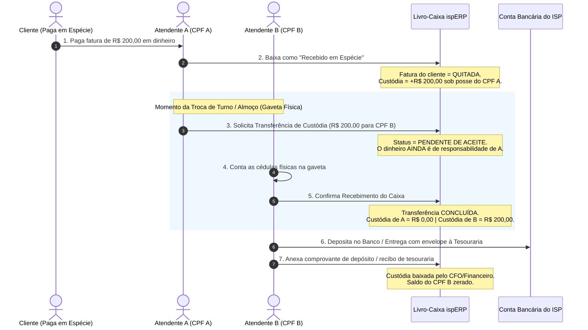

# Sentinela Anti-Fraude v3: Custódia de Caixa por CPF, Passagem de Turno com Duplo Aceite & Governança de ONUs

> **Status:** Rascunho Vivo / Em Discussão  
> **Data:** 2026-09-02  
> **Versão:** v3 (Evolução da v2)  
> **Tema:** Rastreabilidade Absoluta de Dinheiro Vivo por CPF de Colaborador, Transferência de Gaveta/Caixa com Duplo Aceite e Amarração Inviolável de Hardware (ONUs x Contratos de Estrutura).

---

## 1. Rastreabilidade Absoluta de Caixa: O Princípio "Nenhum Centavo Some"

Nos provedores tradicionais, o dinheiro que entra na recepção ou na viatura do técnico é uma "zona cinzenta". Se faltar dinheiro na gaveta, uma atendente culpa a outra, ou o técnico alega que "entregou pro financeiro e eles não anotaram".

No **ispERP**, adota-se o princípio bancário da **Custódia Individualizada por CPF**:
> **Todo centavo em dinheiro vivo que entra no sistema possui um único CPF como fiel depositário até que seja transferido com confirmação mútua ou depositado na conta bancária do provedor.**



---

## 2. Regras de Permissões Rígidas (SoD)

1. **Quem pode dar baixa definitiva e cancelar títulos:**
   - Apenas perfis `ADMIN`, `CFO` e `ADMIN_FINANCEIRO`.
2. **O que acontece quando outros colaboradores (Atendentes/Técnicos) recebem:**
   - Eles podem registrar o recebimento para emitir o recibo pro cliente.
   - Porém, a baixa contábil do título **não liquida no caixa geral da empresa**: ela credita a fatura do cliente e debita uma **Conta Corrente de Custódia vinculada ao CPF do Colaborador** (`user_cash_custody`).
3. **Liquidação da Custódia:**
   - O saldo sob o CPF do colaborador só é zerado de duas formas:
     a) **Depósito em favor da empresa:** Colaborador deposita na conta bancária do ISP e anexa o comprovante (validado pelo CFO).
     b) **Repasse para outro usuário:** Transferência registrada no sistema e **aceita explicitamente** pelo recebedor.
     c) **Recolhimento pelo Cofre/Tesouraria:** O tesoureiro faz a sangria e assina digitalmente o recolhimento.

---

## 3. Governança Físico-Lógica de ONUs (Zero Equipamento Clandestino)

Em telecom, um dos maiores ralos de receita é o provisionamento de "ONUs fantasmas" (técnicos ativando amigos/parentes sem cadastro, roteadores em POPs consumindo banda sem controle ou câmeras instaladas sem registro).

### Regra Mandatória de Provisionamento:
> **Toda ONU autorizada na rede (OLT / FreeRADIUS) DEVE obrigatoriamente possuir um Vínculo Contratual Ativo.**

```mermaid
graph TD
    ONU[ONU / Serial / MAC detectado] --> Check{Qual a finalidade?}
    Check -->|Assinante PF/PJ| ContratoCliente[Contrato de Cliente Pagante\n(Planos Comerciais)]
    Check -->|Uso Próprio do ISP| ContratoInterno[Contrato de Estrutura / Interno\n(Câmeras, POP, Link Interno, Diretoria)]
    Check -->|Sem Contrato| Quarentena[🚨 Quarentena & Relatório de Pendências\n(Sinal bloqueado ou auditado)]
```

1. **Contratos de Estrutura / Internos:**
   - Câmeras de segurança do provedor, antenas de monitoramento, roteador do POP ou links de funcionários/diretoria utilizam **Planos de Estrutura Interna** (Custo R$ 0,00 ou Custo Operacional Interno).
   - Isso garante que a banda esteja alocada, o tráfego contabilizado no IPAM/CGNAT e o equipamento inventariado.
2. **Modo Migração & Relatório de Pendências:**
   - Quando um ISP migra de outro sistema (onde a rede estava desorganizada e cheia de ONUs soltas), as ONUs importadas recebem a tag `MIGRATION_PENDING_MAPPING`.
   - O sistema gera o **Relatório de ONUs Órfãs**, alertando a gerência:
     - *Exemplo: "Existem 42 ONUs sincronizadas na OLT sem contrato financeiro vinculado. Clique aqui para vincular a um cliente ou enviar comando de Desprovisionamento/Corte."*

---

## 4. Impacto Operacional e Jurídico

- **Fim do "Disse me Disse" nas Gavetas:** Cada atendente tem clareza exata de quanto dinheiro está sob sua responsabilidade física.
- **Proteção Jurídico-Trabalhista:** Se um colaborador faltar com a prestação de contas, o sistema tem logs imutáveis com data, hora, IP e confirmações de duplo aceite, eliminando fraudes e respaldando a empresa em qualquer litígio trabalhista.
- **Integridade da Rede Passiva:** Toda porta PON e porta de CTO tem dono e finalidade conhecidos.
