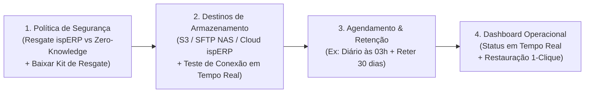

# Brainstorming & Arquitetura: Backup Multi-Destino, Criptografia & Nuvem de Contingência (Disaster Recovery)

> **Status:** Rascunho Vivo / Em Discussão  
> **Data:** 2026-09-01  
> **Objetivo:** Definir a arquitetura completa do módulo de Backup nativo do ispERP em ambiente Docker, pipeline de streaming sem overhead de disco, compressão ZStandard, S3 Multipart Upload (arquivo único consolidado), tempos de execução e contingência em nuvem.

---

## 1. Como o Backup Funciona na Prática em Ambiente Docker (Arquitetura Técnica)

Em um ambiente Docker Compose típico do ispERP, temos:
- Container **`backend`** (Spring Boot Java 25 / Alpine)
- Container **`db`** (PostgreSQL 17)
- Rede interna compartilhada: **`isperp-network`**

```mermaid
flowchart LR
    subgraph ContainerBackend["Container Backend (Spring Boot)"]
        Trigger["Disparo: Agendado ou Botão Web"] --> Proc["pg_dump nativo\n(conecta via TCP no container 'db:5432')"]
        Proc --> PipeMem["Streaming em Memória (Buffer 8MB)\n(Sem gravar arquivo gigante em disco)"]
        PipeMem --> Zstd["Compressão ZStandard (zstd)\nTaxa de 5x a 8x (20GB -> ~3GB)"]
        Zstd --> Enc["Criptografia AES-256 (Java Crypto)"]
    end

    subgraph ContainerDB["Container PostgreSQL ('db')"]
        PGService["PostgreSQL Engine 17\n(Porta 5432 na isperp-network)"]
    end

    subgraph StorageDestino["Destinos Remotos"]
        Enc -->|S3 Multipart Upload / SFTP Pipe| S3[Storage Remoto\n(Consolidado em 1 Único Arquivo Final)]
    end

    Proc <-->|Protocolo TCP Postgres| PGService
```

---

## 2. Quantidade de Arquivos no Destino & S3 Multipart Upload

> [!NOTE]
> **Resultado no Storage:** No destino final (S3, Cloudflare R2, SFTP, NAS ou ispERP Cloud), fica armazenado **apenas 1 ÚNICO ARQUIVO COMPLETO** (ex: `backup_2026-09-01_030000.sql.zst.enc`).

### Como o S3 Multipart Upload junta tudo automaticamente?
1. O backend abre uma sessão de **S3 Multipart Upload**.
2. O Java envia os blocos criptografados de 8 MB conforme são gerados pela memória.
3. Ao finalizar o último bloco, o backend envia a instrução `CompleteMultipartUpload`.
4. O próprio **S3/Cloudflare R2 monta e consolida todas as partes internamente em 1 único arquivo de objeto final**.
5. Quando o administrador baixa o backup pelo painel ou via SFTP, ele baixa **1 arquivo único consolidado**.

---

## 3. Estimativa de Tempo de Execução & Poder da Compressão ZStandard (zstd)

O PostgreSQL armazena dados em tabelas relacionais com alto índice de repetição de texto. A compressão moderna **ZStandard (zstd)** atinge uma taxa de compressão de **5x a 8x** com consumo baixíssimo de CPU.

### O Efeito da Compressão na Prática:
$$\text{Banco PostgreSQL: } \mathbf{20\text{ GB}} \xrightarrow{\text{Zstandard (zstd)}} \text{Arquivo Criptografado Final: } \mathbf{\sim 3\text{ a }4\text{ GB}}$$

### Tempos Estimados de Execução (Transferindo ~3 GB):

| Tipo de Conexão do Provedor | Taxa Real de Upload | Tempo Estimado do Backup de 20GB |
| :--- | :--- | :--- |
| **SFTP para NAS Local (Rede Gigabit 1 Gbps)** | ~100 MB/s | **~30 a 45 segundos** |
| **Nuvem S3 com Link de 500 Mbps** | ~60 MB/s | **~50 a 70 segundos** |
| **Nuvem S3 com Link de 100 Mbps** | ~12 MB/s | **~3 a 4 minutos** |
| **Nuvem S3 com Link de 50 Mbps** | ~6 MB/s | **~7 a 8 minutos** |

> Como o backup roda de madrugada (ex: 03:00 AM) em segundo plano (em thread assíncrona dedicada), **ele não causa nenhum impacto ou lentidão no sistema**.

---

## 4. Fluxo Sequencial de Configuração no Painel Web (Security-First UX)



### 🛡️ Etapa 1: Política de Segurança & Criptografia (Primeiro Passo Obrigatório)
- Escolha: `(o) 🛡️ Modo Resgate ispERP (Recomendado)` vs `( ) 🔒 Modo Zero-Knowledge`.
- Visualização da Chave Mestra e botão `[ Baixar Kit de Resgate (PDF) ]`.

### 💾 Etapa 2: Destinos de Armazenamento & Teste em Tempo Real
- Cadastro de destinos com botão **"🔌 Testar Conexão"** (valida upload/delete de 1KB em tempo real).

### ⏱️ Etapa 3: Agendamento & Retenção
- Horário diário (ex: 03:00 AM) e retenção automática dos últimos 30/60 dias.

### 📊 Etapa 4: Dashboard Operacional & Restauração 1-Clique
- Status do último backup, botão `[ Fazer Backup Agora ]` com barra de progresso e tabela com botão `[ Restaurar ]`.

---

## 5. Restauração Manual de Emergência via Linha de Comando (OpenSSL)

```bash
openssl enc -d -aes-256-cbc -pbkdf2 -in backup_2026_09_01.sql.zst.enc -pass pass:SUA_CHAVE_MESTRA | zstd -d | psql -h localhost -U isperp isperp_db
```

---

## 6. Contingência em Nuvem Automatizada (Disaster Recovery com 15 Dias de Cortesia)
- Em caso de queima física de servidor, a equipe do ispERP pré-provisiona a VPS na nuvem e restaura o último backup. O ISP ganha 15 dias sem custo para consertar o hardware ou migrar definitivamente para a Cloud Gerenciada.
