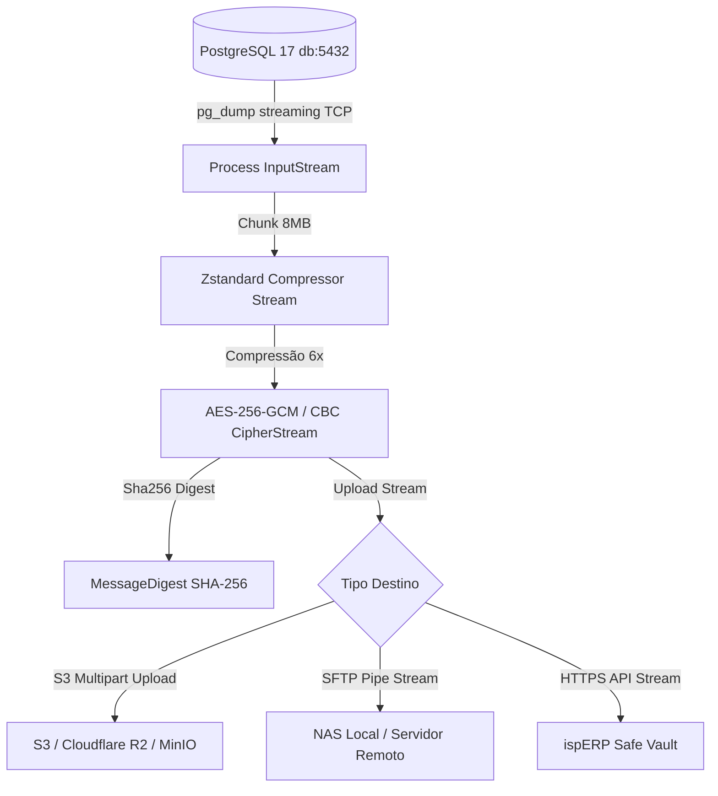

# Especificação Técnica e Modelo de Dados: Backup Multi-Destino, Criptografia AES-256 & Disaster Recovery (v2)

> **Status:** Proposta de Implementação (Milestone 33)  
> **Data:** 2026-09-03  
> **Objetivo:** Definir as entidades JPA, schema Flyway V31, arquitetura de pipeline streaming sem estouro de disco e cockpit operacional no frontend.

---

## 1. Schema do Banco de Dados (Flyway V31)

### 1.1 Tabela `backup_policies`
Armazena a política central de backup do provedor:
- `id`: UUID (v7) PK
- `security_mode`: VARCHAR(30) NOT NULL (`MANAGED_RESCUE`, `ZERO_KNOWLEDGE`)
- `master_key_hash`: VARCHAR(128) NOT NULL (Hash SHA-256 para validação sem guardar chave pura se Zero-Knowledge)
- `encrypted_master_key`: TEXT NULL (Chave cifrada com chave do sistema se `MANAGED_RESCUE`)
- `cron_expression`: VARCHAR(50) NOT NULL DEFAULT '0 0 3 * * *' (Diário às 03:00)
- `retention_days`: INT NOT NULL DEFAULT 30
- `compression_algorithm`: VARCHAR(20) NOT NULL DEFAULT 'ZSTD' (`ZSTD`, `GZIP`)
- `auto_dry_run_enabled`: BOOLEAN NOT NULL DEFAULT TRUE (Teste de integridade automático)
- `rescue_kit_downloaded_at`: TIMESTAMP WITH TIME ZONE NULL
- `is_active`: BOOLEAN NOT NULL DEFAULT TRUE
- `created_at`: TIMESTAMP WITH TIME ZONE NOT NULL DEFAULT NOW()
- `updated_at`: TIMESTAMP WITH TIME ZONE NOT NULL DEFAULT NOW()

### 1.2 Tabela `backup_destinations`
Destinos remotos configurados pelo provedor (S3, Cloudflare R2, SFTP NAS, ispERP Cloud):
- `id`: UUID (v7) PK
- `name`: VARCHAR(100) NOT NULL (ex: "Cloudflare R2 Bucket", "NAS Escritório Central")
- `storage_type`: VARCHAR(30) NOT NULL (`S3_COMPATIBLE`, `SFTP`, `LOCAL_VOLUME`, `ISPERP_CLOUD`)
- `endpoint_url`: VARCHAR(255) NULL (ex: `https://<account_id>.r2.cloudflarestorage.com`)
- `bucket_name`: VARCHAR(100) NULL
- `region`: VARCHAR(50) NULL DEFAULT 'auto'
- `access_key`: VARCHAR(255) NULL
- `secret_key_encrypted`: TEXT NULL (AES-256 protegido)
- `path_prefix`: VARCHAR(255) DEFAULT 'backups/isperp'
- `is_active`: BOOLEAN NOT NULL DEFAULT TRUE
- `is_primary`: BOOLEAN NOT NULL DEFAULT FALSE
- `last_tested_at`: TIMESTAMP WITH TIME ZONE NULL
- `last_test_status`: VARCHAR(20) NULL (`SUCCESS`, `FAILED`)
- `last_test_error`: TEXT NULL
- `created_at`: TIMESTAMP WITH TIME ZONE NOT NULL DEFAULT NOW()
- `updated_at`: TIMESTAMP WITH TIME ZONE NOT NULL DEFAULT NOW()

### 1.3 Tabela `backup_execution_logs`
Histórico e auditoria de cada backup e simulação de restauração:
- `id`: UUID (v7) PK
- `policy_id`: UUID NOT NULL REFERENCES `backup_policies(id)`
- `destination_id`: UUID NULL REFERENCES `backup_destinations(id)`
- `trigger_type`: VARCHAR(30) NOT NULL (`SCHEDULED`, `MANUAL`, `DRY_RUN_VERIFICATION`)
- `status`: VARCHAR(30) NOT NULL (`RUNNING`, `SUCCESS`, `FAILED`, `VERIFIED_OK`)
- `file_name`: VARCHAR(255) NOT NULL (ex: `isperp_backup_20260903_030000.sql.zst.enc`)
- `original_size_bytes`: BIGINT NULL
- `compressed_size_bytes`: BIGINT NULL
- `compression_ratio`: NUMERIC(5, 2) NULL
- `sha256_hash`: VARCHAR(64) NULL (Hash da carga criptografada final)
- `duration_seconds`: INT NULL
- `error_message`: TEXT NULL
- `is_dry_run_verified`: BOOLEAN NOT NULL DEFAULT FALSE
- `dry_run_verified_at`: TIMESTAMP WITH TIME ZONE NULL
- `started_at`: TIMESTAMP WITH TIME ZONE NOT NULL DEFAULT NOW()
- `completed_at`: TIMESTAMP WITH TIME ZONE NULL

---

## 2. Pipeline de Streaming Sem Impacto de Disco

### Principais Benefícios:
1. **Consumo Zero de Disco Adicional**: O banco de 20 GB não gera um arquivo temporário de 20 GB na VPS antes de subir; ele flui em chunks de memória de 8 MB.
2. **Criptografia Militar Antes do Tráfego de Rede**: O arquivo sai do container backend já cifrado com AES-256 e chave forte. Ninguém na rede ou no provedor S3 consegue abrir o arquivo sem a chave mestra.
3. **Integridade Garantida**: O hash SHA-256 é gerado ao longo do fluxo e gravado no banco de dados e no log para auditoria de integridade pericial.

---

## 3. Experiência do Usuário (Wizard de Segurança & Cockpit)

### Painel Web (`/settings/backup`):
- **Card dos 3 Indicadores Sagrados**:
  1. *Status do Último Backup* (ex: "Há 4 horas - Sucesso (3.2 GB / 22.4 GB - 85% reduzido)")
  2. *Próximo Disparo Programado* (ex: "Hoje às 03:00")
  3. *Último Teste de Restauração (Dry-Run)* (ex: "100% íntegro testado ontem")
- **Botões Imediatos**:
  - `[ 🚀 Fazer Backup Agora ]` com barra de progresso em tempo real e logs de streaming.
  - `[ 📑 Baixar Kit de Resgate de Emergência (PDF) ]` contendo a chave mestra, QR Code de recuperação e comando OpenSSL pronto para cópia.
  - `[ 🔌 Testar Conexão do Storage ]` que valida permissão de escrita e exclusão sem afetar dados.
