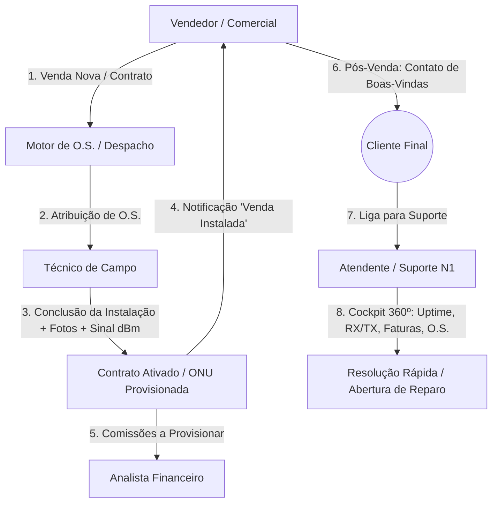

# Arquitetura de Perfis, Cockpits Dedicados & Esteira de Trabalho Integrada (RBAC Operacional)
**Versão**: v1  
**Data**: 2026-09-03  
**Status**: Levantamento de Requisitos e Arquitetura de Negócio  

---

## 1. Princípio Fundamental: "Cada um na sua Tela, com Foco e Máxima Otimização"

Um ERP de telecomunicações de alta performance não pode ser um emaranhado de tabelas genéricas onde todos veem tudo. Cada colaborador possui uma missão específica na operação do provedor:
- **Zero Distração & Máxima Agilidade**: A interface deve abrir direto no cockpit da função do colaborador.
- **Segregação de Funções (SoD) & Menor Privilégio (PoLP)**: O vendedor não mexe em conciliação bancária; o técnico não vê DRE; o atendente foca em resolver a dor do cliente em menos de 60 segundos.
- **Fluxo Contínuo & Handover Automático**: O que um papel faz gera impacto e notificação imediata no próximo papel da cadeia de valor.

---

## 2. As Personas Operacionais e Seus Cockpits Dedicados

---

### 2.1. Cockpit do Vendedor / Comercial (`/seller/dashboard` ou `/commercial/cockpit`)
* **Objetivo**: Vender mais, acompanhar seus leads, controlar suas metas e saber exatamente quanto vai receber no bolso.
* **Elementos da Tela**:
  1. **Termômetro de Metas do Mês**:
     - Vendas Realizadas vs. Meta do Mês (ex: 28/40 adesões).
     - Projeção de atingimento.
  2. **Extrato de Comissões**:
     - Comissões Confirmadas (instaladas e validadas).
     - Provisionamento do Financeiro (data prevista de pagamento).
     - Comissões Pendentes (aguardando instalação técnica).
  3. **Minhas Vendas & Status da Esteira**:
     - Tabela dinâmica com as vendas feitas pelo vendedor logado.
     - Indicador claro de status: `Aguardando Agendamento` ➔ `Técnico em Deslocamento` ➔ `Instalado / Ativado com Sucesso`!
  4. **Alerta de Handover de Pós-Venda (Boas-Vindas)**:
     - Assim que o técnico fecha a O.S. no aplicativo de campo, o card daquele cliente pisca em verde no cockpit do vendedor:
       *"🎉 Venda Instalada hoje às 14:20 por Carlos Alberto. Ligue para o cliente e faça o pós-venda!"*
     - Botão de 1 clique: `Ligar / Abrir WhatsApp com mensagem de boas-vindas`.

---

### 2.2. Cockpit do Técnico de Campo (`/technician/field`)
* **Objetivo**: Executar as instalações e manutenções do dia com o celular na mão, sem burocracia e com prova técnica irrefutável.
* **Elementos da Tela**:
  1. **Minha Fila do Dia (Roteirizada)**:
     - Ordens de Serviço atribuídas a ele, ordenadas por proximidade geográfica e janela de horário.
  2. **Execução de O.S. (Passo a Passo)**:
     - Iniciar Deslocamento (GPS/Check-in).
     - Chegada no Local.
     - Escanear / Digitar MAC e Serial da ONU.
     - Validação de Potência Óptica (ex: Sinal RX: `-19.2 dBm` - Dentro dos conformes).
     - Upload de Fotos da Instalação (foto da caixa CTO, conectorização, fixação da ONU e teste de velocidade no Wi-Fi).
  3. **Conclusão com Assinatura Digital**:
     - Cliente assina na tela do celular ou via token SMS/WhatsApp.
     - Ao concluir:
       - O contrato muda para `ACTIVE`.
       - A ONU é provisionada no OLT/RADIUS.
       - Dispara gatilho para o vendedor de pós-venda.

---

### 2.3. Cockpit 360º do Atendente (`/support/attendant-cockpit`)
* **Objetivo**: Atender a ligação do cliente e em 3 segundos ter toda a vida técnica e financeira do cliente na ponta dos dedos.
* **Elementos da Tela**:
  1. **Busca Instantânea por Chamada/Identificação**:
     - Campo de busca global rápido por CPF, Nome, Telefone, Endereço ou IP.
  2. **Card de Telemetria de Conexão em Tempo Real**:
     - Status: 🟢 **ONLINE** (há 14 dias, 6h) ou 🔴 **OFFLINE** (caiu há 23 minutos por falta de energia / LOS).
     - Sinal Óptico: `-18.5 dBm` (Excelente).
     - Gráfico de Consumo das últimas 24h / 7 dias (Down/Up).
     - Botão de ação rápida: `Diagnosticar ONU`, `Reiniciar ONU remotamente` ou `Limpar MAC/Sessão PPPoE`.
  3. **Card Financeiro Resumido**:
     - Faturas pagas vs vencidas.
     - Botão `Copiar Código Pix` para mandar pro WhatsApp do cliente durante a ligação.
     - Botão `Desbloqueio em Confiança (48h)` caso esteja bloqueado e prometa pagar.
  4. **Linha do Tempo (Últimas O.S. e Chamados)**:
     - O que já foi feito na casa dele no passado (para não perguntar o que já foi registrado).

---

### 2.4. Cockpit do Administrador / Diretor (`/` ou `/dashboard`)
* **Objetivo**: Gestão holística, Governança, DRE, EBITDA, Tráfego de Rede, Alavancagem e Configurações Globais.
* Acesso irrestrito a todos os módulos, com visão agregada e auditoria forense.

---

## 3. Próximos Passos de Modelagem & Arquitetura
1. Mapear os Perfis no Spring Security e Frontend (`ADMIN`, `SELLER`, `TECHNICIAN`, `ATTENDANT`, `FINANCIAL`, `NOC`).
2. Definir o redirecionamento pós-login:
   - Se logar como `SELLER` ➔ vai direto para `/seller/dashboard`.
   - Se logar como `TECHNICIAN` ➔ vai direto para `/technician/field`.
   - Se logar como `ATTENDANT` ➔ vai direto para `/support/attendant-cockpit`.
   - Se logar como `ADMIN` ➔ visualiza o dashboard executivo com menu completo.
3. Especificar os eventos de integração (`WorkOrderCompletedEvent` ➔ notifica Vendedor + provisiona Comissão no Financeiro).
