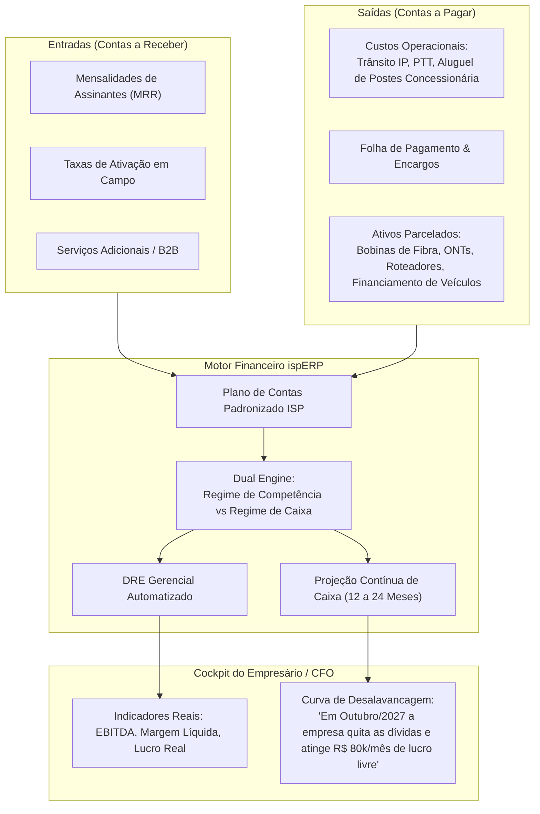

# Gestão Financeira Contínua v1: Contas a Pagar/Receber, Fluxo de Caixa Real, DRE Gerencial & Curva de Desalavancagem

> **Status:** Rascunho Vivo / Em Discussão  
> **Data:** 2026-09-02  
> **Versão:** v1 (Conceito Inicial)  
> **Tema:** O Grande Oceano Azul do ispERP: Gestão Financeira Empresarial Real (DRE Gerencial por Competência e Caixa, Contas a Pagar/Receber Unificados, Fluxo de Caixa Contínuo e Projeção de Saída do Vermelho/Lucro).

---

## 1. O Diagnóstico: Por que os ERPs de Provedor Falham Miseravelmente no Financeiro?

A esmagadora maioria dos sistemas de mercado (IXC, MK-Auth, SGP, RadiusNet, Voalle) foi construída por profissionais de rede/telecom, e não por gestores financeiros ou contadores.

### As Falhas Crônicas dos Sistemas Concorrentes:
1. **Foco Míope em "Cobrança de Boleto":** Eles sabem emitir boleto e bloquear o sinal no RADIUS. Mas quase nenhum possui um **Contas a Pagar** que converse nativamente com o **Contas a Receber**.
2. **Abandono do Contas a Pagar:** O dono do provedor é obrigado a usar um sistema separado (Bling, Omie, Conta Azul ou planilhas de Excel caóticas) para cadastrar contas de luz, aluguel de postes, compra de bobinas de fibra e folha de pagamento.
3. **Ausência de DRE (Demonstração do Resultado do Exercício):** O empresário não sabe se o provedor dá lucro ou prejuízo no fim do mês. Ele confunde *"ter dinheiro na conta hoje"* com *"a empresa ser lucrativa"*.
4. **Cegueira de Futuro (Desalavancagem e Saída do Vermelho):** Provedores de internet compram máquinas de fusão, caminhonetes e quilômetros de fibra em parcelamentos longos (12x, 24x, 36x) ou empréstimos bancários. Nenhum sistema mostra: **"Dado o meu crescimento de contratos e as parcelas das minhas dívidas, em qual mês exato meu caixa vira e eu saio do vermelho?"**

---

## 2. A Visão do ispERP: O Financeiro Corporativo em Fluxo Contínuo

No **ispERP**, o financeiro é tratado como um organismo vivo contínuo, onde cada contratação, cada compra de material e cada dívida parcelada alimenta instantaneamente o cockpit de decisão do empresário.

---

## 3. O DRE Gerencial do ispERP (Especializado em Telecom)

O sistema gera automaticamente a Demonstração do Resultado, sem depender do fechamento demorado do contador externo:

| Linha do DRE | Descrição & Itens Típicos de ISP |
| :--- | :--- |
| **(=) RECEITA BRUTA** | Mensalidades de Internet (SCM) + SVAs + Taxas de Ativação / Mudança de Endereço. |
| **(-) Deduções da Receita** | Tributos Fiscais (ICMS NFCom Mod. 62, PIS/COFINS, FUST, FUNTTEL) + Cancelamentos/Glosa. |
| **(=) RECEITA OPERACIONAL LÍQUIDA** | Faturamento real limpo disponível para custear a operação. |
| **(-) Custos dos Serviços Prestados (CSP)** | Link Dedicado / Trânsito IP, PTT, Aluguel de Postes (Concessionária de Energia), Conectores, Drops gastos. |
| **(=) LUCRO BRUTO** | Eficiência direta da entrega da rede de fibra. |
| **(-) Despesas Operacionais (OPEX)** | Folha dos Técnicos e Atendentes, Combustível, Aluguel de Escritórios, Marketing e Vendas. |
| **(=) EBITDA (LAJIDA)** | **Geração de Caixa Operacional Puro da Empresa**. O indicador mais importante para valuation de ISPs. |
| **(-) Depreciação e Amortização** | Desgaste de OLTs, Roteadores, Fusões e Veículos ao longo do tempo. |
| **(-) Despesas Financeiras** | Juros de Empréstimos, Tarifas Bancárias (Taxa de Boletos e Pix) e Juros de Financiamentos. |
| **(=) LUCRO LÍQUIDO DO EXERCÍCIO** | O resultado final que realmente sobra para os sócios ou reinvestimento. |

---

## 4. O Simulador de Curva de Desalavancagem ("Quando Vou Sair do Vermelho?")

Este é o recurso que nenhum outro software tem:

### O Desafio Matemático do Provedor em Crescimento:
- O ISP compra 50 bobinas de fibra e 500 ONTs parceladas em 18 vezes.
- Ele contrata 3 técnicos novos e financia uma viatura em 36 vezes.
- O caixa dele hoje pode estar no vermelho ou apertado, mas a cada mês entram **novos contratos recorrentes (MRR)**.

### Como o Algoritmo do ispERP Calcula a Curva:
$$\text{Fluxo Futuro}(Mês_i) = \left(\text{MRR Base} \times (1 + \text{Taxa Crescimento Líquida})^i \times (1 - \text{Inadimplência Histórica})\right) - \text{Custos Fixos} - \sum \text{Parcelas Ativas}(Mês_i)$$

### O Que o Empresário Vê na Tela:
1. **Linha de Sobrevivência de Caixa:** Mostra exatamente o "fundo do poço" (o mês de menor caixa da empresa) para alertar se ele precisará de capital de giro temporário.
2. **Data de Virada (Break-Even das Dívidas):**  
   > *"Com o ritmo atual de 45 novas ativações/mês e o encerramento do parcelamento do link/máquinas em Março/2027, seu fluxo de caixa passará a ser positivo em **Novembro/2026** e atingirá maturidade financeira em **Maio/2027** com R$ 65.400,00 de sobra líquida mensal."*
3. **Simulador de Decisão de Investimento ("E se...?"):**
   - *"E se eu financiar mais R$ 100.000 em fibra agora em 12x?"*  
   - O sistema recalcula a curva em tempo real e avisa se a decisão quebra o caixa ou se o crescimento de clientes cobre a parcela.

---

## 5. Próximos Passos
- Validar se essa estrutura de DRE e o simulador de saída do vermelho traduzem fielmente a clareza que você sempre quis ter sobre o seu negócio.
- Modelar o módulo de Contas a Pagar integrado com categorias específicas de Telecomunicações.
