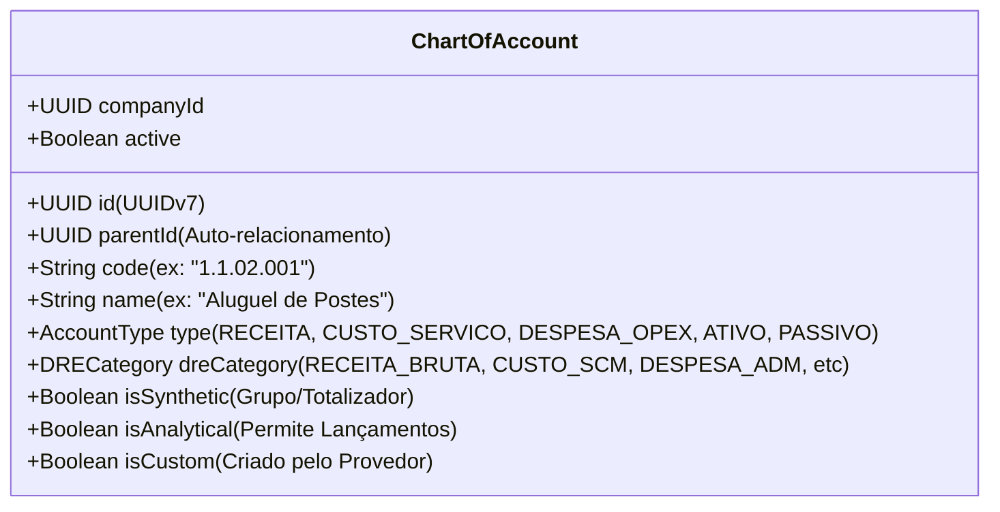
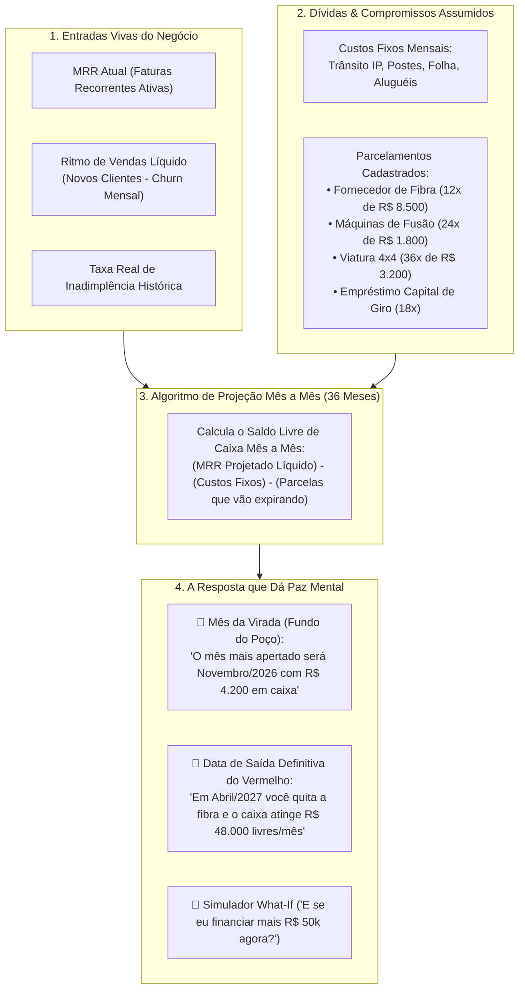

# Gestão Financeira v2: Plano de Contas Orientado a Objetos & Motor de Desalavancagem (Saída do Vermelho)

> **Status:** Rascunho Vivo / Em Discussão  
> **Data:** 2026-09-02  
> **Versão:** v2 (Evolução da v1)  
> **Tema Central:** O Coração do ispERP: Plano de Contas 100% Dinâmico e Customizável pelo Contador/Consultor + O Simulador de Curva de Desalavancagem ("Quando Vou Sair do Vermelho?").

---

## 1. Plano de Contas Dinâmico & Orientado a Objetos (Totalmente Customizável)

Provedores estão no mesmo segmento, mas a maturidade contábil e as exigências fiscais variam brutalmente:
- Alguns têm contabilidade interna avançada com consultores e já possuem um plano de contas estruturado no Domínio Sistemas, Questor ou Senior.
- Outros estão começando e precisam de um template padrão maduro já pronto para uso.

Por isso, **o plano de contas no ispERP NUNCA será um enum ou código engessado no Java**. Ele é modelado como uma **estrutura hierárquica em árvore auto-referenciada (Self-Referencing Tree)** no banco de dados.

### Estrutura de Dados (Entidade `ChartOfAccount`):

### Como Funciona na Prática:
1. **Template Padrão ISP Sugerido (1-Clique):**
   - Ao iniciar a empresa, o sistema disponibiliza o catálogo padrão com as particularidades de Telecom (Trânsito IP, PTT, Concessionária de Energia/Postes, Manutenção de Dropline, Combustível de Frota, SVA, SCM).
2. **Liberdade Total para o Contador e Consultores:**
   - O gestor/contador pode **cadastrar novas contas analíticas e sintéticas**, renomear contas existentes, inativar contas não utilizadas e importar/exportar a árvore inteira via CSV ou JSON.
3. **Classificação Contábil no Contas a Pagar / Receber:**
   - Cada despesa lançada (ex: boleto da concessionária de energia ou nota fiscal de bobinas de fibra) aponta para um nó analítico do plano de contas daquela empresa.
   - O motor de DRE lê a propriedade `dreCategory` para agrupar os números no lugar certo, respeitando a nomenclatura que o contador definiu.

---

## 2. O Santo Graal do Projeto: Motor de Desalavancagem & Previsão de Saída do Vermelho

> *"É o que eu mais quero desse projeto, se tudo der errado, mas esse funcionar, valeu a pena."*

Esta frase traduz a angústia de 99% dos donos de provedores de internet no Brasil. 
O negócio de ISP é intensivo em capital (**CAPEX pesado**):
- O empresário compra 50 km de fibra, máquinas de fusão, bobinas e centenas de ONTs.
- Ele financia caminhonetes e contrata técnicos antes mesmo de ter a receita.
- As parcelas chegam no dia 10, a conta do link dedicado chega no dia 15, o imposto no dia 20.
- O empresário acorda de madrugada suando frio sem saber: **"Meu negócio está gerando riqueza real ou estou apenas trocando dinheiro e afundando em dívidas?"**

---

## 3. A Matemática da Curva de Desalavancagem

Para cada mês futuro $t \in [1, 36]$:

$$\text{Receita Recorrente}(t) = \left[ \text{MRR}_0 + \sum_{k=1}^{t} (\text{Novas Ativações}_k - \text{Cancelamentos}_k) \times \text{Ticket Médio} \right] \times (1 - \text{Inadimplência})$$

$$\text{Saídas Totais}(t) = \text{Custos Fixos Operacionais} + \sum_{d \in \text{Dívidas Ativas}(t)} \text{Parcela}_d(t)$$

$$\text{Geração de Caixa Livre}(t) = \text{Receita Recorrente}(t) - \text{Saídas Totais}(t)$$

$$\text{Posição Cumulativa de Caixa}(t) = \text{Caixa Inicial} + \sum_{k=1}^{t} \text{Geração de Caixa Livre}(k)$$

### O Que Essa Equação Revela ao Dono:
1. **O "Fundo do Poço" (Maximum Drawdown de Caixa):**
   - O menor ponto da curva. O sistema avisa com meses de antecedência se a empresa corre risco de ficar sem dinheiro para a folha de pagamento em algum mês específico, permitindo negociar prazos com calma antes do sufoco.
2. **O Ponto de Inflexão (A Virada das Dívidas):**
   - Conforme as dívidas parceladas mais curtas vão sendo quitadas (ex: a fibra acaba em 10 meses), o peso sobre o caixa diminui drasticamente, enquanto o número de assinantes continua empurrando o MRR para cima.
   - O gráfico traça uma **linha verde ascendente**, mostrando o momento exato em que a empresa atinge **lucro líquido desimpedido**.

---

## 4. O Simulador de Decisão do Dono ("What-If Engine / E Se...?")

O empresário está no escritório negociando com um vendedor de cabos ópticos ou com o gerente do banco. Ele abre o celular e simula:

- **Cenário 1: "E se eu comprar 100 bobinas de fibra e parcelar em 10x de R$ 12.000?"**
  - O sistema plota a nova curva sobre a curva atual em tempo real:
  - *Resultado do ispERP:* 🔴 *"Atenção: esta dívida fará seu caixa ficar negativo em -R$ 14.500 no mês 5. Para este investimento ser seguro, você precisa de 3 meses de carência ou aumentar suas vendas em 15 assinantes/mês."*
- **Cenário 2: "E se a inadimplência subir de 6% para 10% nos meses de chuva/feriado?"**
  - O sistema mostra o teste de estresse (*stress test*) da operação.

---

## 5. Como Isso Transforma o ispERP em Algo Único no Mundo

- Não existe nenhum software no Brasil que faça isso nativamente para provedores de internet.
- Todos os concorrentes são ferramentas de cobrança e rede. O ispERP passa a ser o **CFO Virtual do Dono**, a bússola que dá segurança psicológica para investir e dormir em paz.
- **Segurança da Informação:** Apenas os usuários com papel `OWNER`, `DIRECTOR` ou `CFO` têm acesso a essa tela. Nenhum funcionário comum tem visibilidade desses indicadores estratégicos.

---

## 6. Próximos Passos
- Validar as entidades do **Plano de Contas Dinâmico** (`ChartOfAccount`) e do **Contas a Pagar** (`PayableInvoice` com parcelamento / `ExpenseInstallment`).
- Estruturar a suíte de testes unitários para a matemática de projeção e a curva de desalavancagem.
