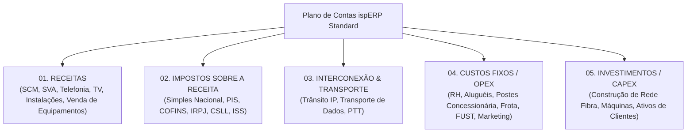
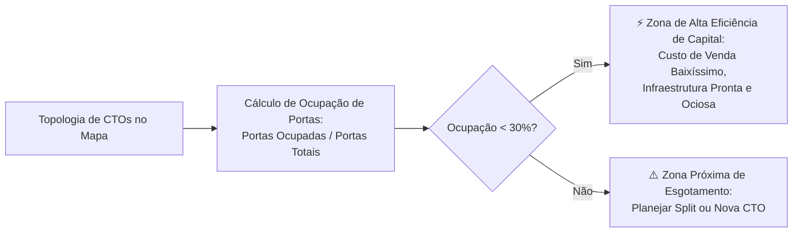

# Gestão Financeira v3: Plano de Contas Especializado de 5 Níveis, DRE e Métricas Operacionais de ISP

> **Status:** Rascunho Vivo / Em Discussão  
> **Data:** 2026-09-02  
> **Versão:** v3 (Evolução da v2)  
> **Tema Central:** Engenharia Contábil e Financeira para Provedores de Internet (ispERP Standard): Plano de Contas Estruturado em 5 Níveis, DRE Gerencial, Otimização de Ocupação de Portas FTTH e Comissionamento Escalonado.

---

## 1. Padrão Contábil de Mercado para Provedores (ispERP Standard)

Para garantir que o **ispERP** atenda com precisão tanto o pequeno provedor local quanto operações de grande porte, o sistema disponibiliza um **Template Padrão Sugerido** baseado nas melhores práticas fiscais e contábeis de telecomunicações no Brasil (normas da Anatel, Lei 9.472/1997 e Convênio ICMS 115/03 / NFCom Modelo 62).

Este modelo é 100% flexível e dinâmico, permitindo que a equipe contábil do provedor customize, expanda ou importe seu próprio plano existente.

---

## 2. Estrutura Canônica das Contas Analíticas

### Grupo 01: RECEITAS
- **01.01 Serviços (Incidência de ISS):**
  - `01.01.01` Taxa de Instalação / Ativação em Campo
  - `01.01.02` Transferência de Endereço / Ponto Adicional
  - `01.01.03` Visita Técnica e Suporte Presencial
  - `01.01.04` Infraestrutura e Locação de Rede de Terceiros
  - `01.01.05` Assessoria e Configurações Especializadas
  - `01.01.06` Segunda Via de Carnê / Taxas Administrativas
- **01.02 Produtos (Incidência de ICMS):**
  - `01.02.01` Venda de Roteadores Wi-Fi / ONUs
  - `01.02.02` Materiais de Conectividade e Informática
- **01.03 Outras Receitas Operacionais:**
  - `01.03.01` Locação de Espaço em Torres / Compartilhamento de Infra
  - `01.03.02` Multa Contratual por Fidelidade / Quebra de Contrato
  - `01.03.03` Venda de Bens e Equipamentos Descontinuados
- **01.04 Telecomunicações & Multimídia:**
  - `01.04.01` Receita Bruta de Internet (SCM): Varejo, PME, Corporativo, Atacado e Governo
  - `01.04.02` Serviços de Valor Adicionado (SVA): Streaming, IP Fixo, Segurança Digital, Lan-to-Lan
  - `01.04.03` Telefonia Fixa Comutada (STFC) e Telefonia IP (VoIP)
  - `01.04.04` Serviço de Acesso Condicionado (TV SeAC)
- **01.05 Entradas Financeiras & Patrimoniais:**
  - `01.05.01` Empréstimos e Financiamentos Bancários
  - `01.05.02` Resgate de Aplicações Financeiras
  - `01.05.03` Cobrança de Juros e Multas de Inadimplência
  - `01.05.04` Aportes de Capital pelos Sócios

### Grupo 02: IMPOSTOS SOBRE A RECEITA
- `02.01.01` Simples Nacional (Anexo III e Anexo IV)
- `02.01.02` CSLL (Contribuição Social sobre o Lucro Líquido)
- `02.01.03` PIS (Programa de Integração Social)
- `02.01.04` COFINS (Contribuição para o Financiamento da Seguridade Social)
- `02.01.05` IRPJ (Imposto de Renda Pessoa Jurídica)
- `02.01.06` ISS (Imposto Sobre Serviços Municipal)

### Grupo 03: INTERCONEXÃO & CUSTOS DIRETOS DE BANDA
- `03.01.01` Trânsito IP (Link Dedicado / Operadoras de Borda)
- `03.01.02` Transporte IP / Ponto a Ponto de Longa Distância
- `03.01.03` Custos de Interconexão Telefônica / Minutos de Borda

### Grupo 04: CUSTOS FIXOS & DESPESAS OPERACIONAIS (OPEX)
- **04.01 Recursos Humanos:**
  - `04.01.01` Folha de Pagamento Base (Técnicos, Suporte, Atendimento)
  - `04.01.02` Comissões de Vendas e Desempenho
  - `04.01.03` Encargos Trabalhistas (FGTS, INSS Patronal, Férias, 13º Salário)
  - `04.01.04` Benefícios (Vale Alimentação, Refeição, Transporte, Seguro de Vida)
  - `04.01.05` Pró-Labore da Diretoria
  - `04.01.06` Equipamentos de Proteção Individual (EPI) e Fardamento
- **04.02 Administrativo, Frota & Instalações:**
  - `04.02.01` Despesas de Escritório, Cartório, Limpeza e Suprimentos
  - `04.02.02` Combustível, Lubrificantes e Manutenção de Viaturas
  - `04.02.03` Seguro de Frota, IPVA, Licenciamento e Rastreadores
  - `04.02.04` Aluguel de Imóveis (Lojas Físicas e Escritório Central)
  - `04.02.05` **Aluguel de Torre / Espaço em POP de Terceiros**
  - `04.02.06` **Compartilhamento de Postes (Concessionária de Distribuição de Energia)**
- **04.03 Tributos Setoriais & Contribuições:**
  - `04.03.01` FUST (Fundo de Universalização dos Serviços de Telecomunicações)
  - `04.03.02` FUNTTEL (Fundo para o Desenvolvimento Tecnológico das Telecomunicações)
  - `04.03.03` TFI (Taxa de Fiscalização de Instalação - Anatel)
  - `04.03.04` Contribuições Sindicais, CREA e Registro de Responsabilidade Técnica (ART)
  - `04.03.05` NIC.br (Anuidades de ASN e Blocos IP)
- **04.04 Marketing, Captação & Vendas:**
  - Tráfego Pago, Mídia Externa (Outdoors, Rádio), Material Gráfico e Brindes.
- **04.05 Despesas Financeiras:**
  - Tarifas de Liquidação de Cobrança (Boletos e Pix), Manutenção de Conta e Juros Bancários.

### Grupo 05: INVESTIMENTOS & CAPEX (Alimentação da Curva de Desalavancagem)
- **05.01 Aquisição de Bens de Longo Prazo:**
  - Veículos Utilitários para Equipes Técnicas
  - Máquinas de Fusão Óptica, OTDRs, Clivadores e Instrumentos de Teste
- **05.02 Construção e Expansão de Rede Passiva FTTH:**
  - Bobinas de Cabo Óptico (Troncal e Distribuição)
  - Caixas de Emenda Óptica (CEO), Splitters Balanceados/Desbalanceados e Ferragens
  - Mão de Obra de Implantação e Lançamento
- **05.03 Equipamentos de Borda & Núcleo:**
  - Servidores, Concentradores BRAS/BNG, Roteadores de Borda e OLTs
- **05.04 Ativação de Novos Assinantes (Custo de Ativação):**
  - ONTs / Roteadores em Comodato, Cabos Drop e Conectores de Campo

---

## 3. Otimização de Ocupação de Portas FTTH & Vendas de Alta Margem

O sistema correlaciona a documentação física da rede FTTH com a estratégia comercial:

- **Princípio Econômico:** A ativação de um cliente em uma CTO com portas ociosas possui **custo marginal quase zero**, maximizando a margem líquida e acelerando o retorno do investimento já realizado em cabos.
- **Painel de Ociosidade Comercial:** O sistema destaca para a equipe comercial as ruas e bairros onde a rede já está disponível com capacidade ociosa, direcionando esforços de prospecção.

---

## 4. Comissionamento Escalonado de Vendas

Para alinhar incentivos com a saúde do caixa, o motor de comissionamento do ispERP calcula automaticamente os valores a pagar:
- **Faixas Progressivas por Atingimento de Meta:**
  - `< 80% da Meta`: Comissão mínima de garantia.
  - `80% a 100% da Meta`: Comissão base (ex: 10% da receita líquida adicionada).
  - `101% a 120% da Meta`: Bonificação progressiva (ex: 15% sobre o excedente).
  - `> 120% da Meta`: Alavancagem máxima (ex: 30% sobre o excedente).
- **Ponderação por Ticket Médio:** Vendas de planos corporativos ou de maior ticket médio geram multiplicador positivo, desincentivando a venda de planos de margem baixa.
- **Alimentação Direta do Contas a Pagar:** O valor consolidado no encerramento do mês é lançado diretamente na conta `04.01.02 Comissões de Vendas`.

---

## 5. Próximos Passos
- Incorporar esta estrutura de 5 níveis no seeder do Flyway para provisionamento do plano padrão.
- Validar os modelos relacionais das tabelas `chart_of_accounts`, `payable_invoices` e `expense_installments`.
