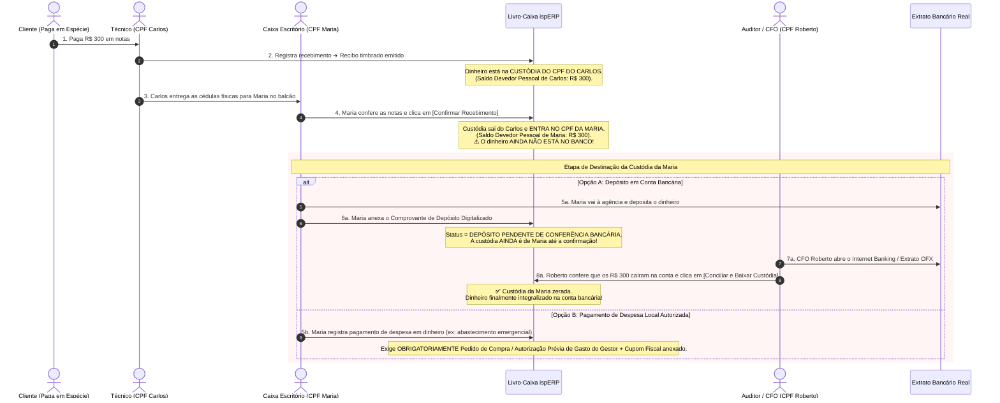
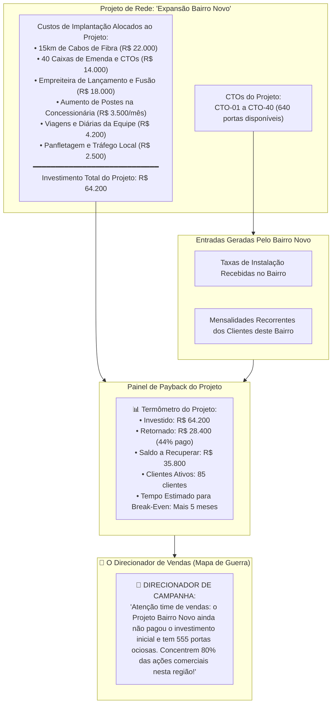

# Gestão Financeira v5: Custódia Material por CPF, Ciclo Estrito de Dinheiro & Payback por Projeto de Rede

> **Status:** Rascunho Vivo / Em Discussão  
> **Data:** 2026-09-02  
> **Versão:** v5 (Evolução da v4)  
> **Tema Central:** Correções de Rigor Operacional: Eliminação de "Estoque Móvel" (Apenas CPF responde por materiais e dinheiro), Rastreabilidade Bancária com Dupla Conferência de Depósito e Gestão de Payback / CAC por Projeto de Rede (Mapa de Guerra Comercial).

---

## 1. Princípio da Responsabilidade Pessoal: "Veículo Não Tem CPF"

Em auditoria e direito trabalhista/cível, **um veículo utilitário é apenas uma lata inanimada sem responsabilidade jurídica**. Se sumirem 5 ONTs ou 3 bobinas de drop da caçamba de uma caminhonete, o veículo não pode ser acionado judicialmente nem prestar contas.

### A Regra Inviolável no ispERP:
> **Não existe "estoque de viatura". Todo e qualquer equipamento ou insumo em campo está sob a guarda e Carga Patrimonial do CPF DO COLABORADOR.**

```mermaid
graph LR
    Almoxarifado[Almoxarifado Central] -->|Carga de Materiais com Assinatura Digital| CPFTecnico[CPF do Técnico Carlos\n(Fiel Depositário)]
    CPFTecnico -->|Troca de Viatura| CPFTecnico
    CPFTecnico -->|Repasse de Peças| CPFOutroTecnico[CPF do Técnico Marcos\n(Exige Duplo Aceite de Contagem)]
    CPFTecnico -->|Instalação no Cliente| ContratoCliente[Baixa por Número de Série na O.S.]
```

- **Troca de Carro:** Se o técnico Carlos deixar a viatura na oficina e pegar outra, a responsabilidade dos materiais continua 100% no CPF dele.
- **Transferência entre Técnicos:** Se Carlos repassar 3 ONTs para Marcos na rua, abre uma transferência no aplicativo. Marcos deve conferir os números de série e clicar em `[ Confirmar Recebimento de Carga ]`. Sem isso, o material continua na responsabilidade do Carlos.

---

## 2. Ciclo Estrito de Dinheiro Vivo: Nenhuma Suposição de Depósito

Estar nas mãos da atendente Maria **NÃO SIGNIFICA** que o dinheiro entrou na conta bancária da empresa. A criatividade humana para desvios não tem limites.

### A Jornada Rígida de Cada Centavo em Dinheiro Vivo:



---

## 3. O CAC Real & A Gestão Financeira por PROJETO DE REDE

Você está coberto de razão: **R$ 300,00 de taxa de ativação não pagam o CAC real de um cliente de fibra**.
O CAC real de telecomunicações é muito mais pesado:
- ONT Wi-Fi: ~R$ 300,00.
- Cabo Drop (ex: 200m a R$ 0,50/m): R$ 100,00.
- Conectores ópticos de campo (par): R$ 20,00.
- PTO, cordão óptico e fixadores: R$ 15,00.
- Hora técnica do instalador + Encargos: ~R$ 60,00.
- Combustível e desgaste da viatura (viagem ida e volta): ~R$ 50,00 a R$ 120,00.
- **CAC Real Total da Instalação:** ~R$ 545,00 a R$ 650,00.
- **Déficit Imediato na Ativação:** O cliente pagou R$ 300,00 ➔ A empresa ainda está no **negativo em -R$ 245,00 a -R$ 350,00** logo no primeiro dia! Esse valor só começa a se pagar a partir da 3ª ou 4ª mensalidade.

---

## 4. O Mapa de Guerra Comercial: Projetos de Rede com Payback Georreferenciado

Em vez de apenas misturar tudo em uma panela só, o ispERP introduz a **Gestão Financeira por Projeto de Expansão de Rede (Centro de Custo Topológico)**.



### Como Isso Muda o Jogo para o Dono do Provedor:
1. **Fim dos Tiros no Escuro:** O empresário descobre com clareza quais projetos foram lucrativos e quais viraram "cemitérios de cabos" que nunca deram retorno.
2. **Campanhas de Vendas Cirúrgicas:** Em vez de fazer panfletagem genérica na cidade inteira, a gerência comercial abre o painel do ispERP e filtra os projetos com **menor taxa de retorno sobre o investimento**. A equipe de vendas é enviada exatamente para as ruas onde a fibra já está paga e as portas estão ociosas esperando cliente.
3. **Métrica de Saúde por Projeto:**
   $$\text{Payback Líquido do Projeto} = \text{Investimento Total de Implantação} - \sum (\text{Ativações} + \text{Mensalidades Líquidas dos Clientes Vinculados})$$

---

## 5. Próximos Passos
- Incorporar a entidade `NetworkProject` (Projeto de Rede) com relacionamento para `FtthClosure`, `FtthCto` e `ChartOfAccount` (Centro de Custos).
- Modelar o fluxo de **Depósito Bancário com Duplo Aceite do Financeiro**.
- Modelar o fluxo de **Pedidos de Compra / Autorização Prévia de Despesas em Espécie**.
