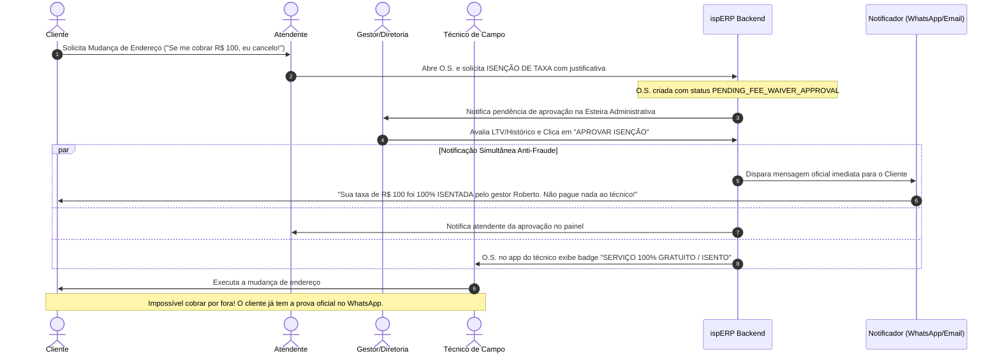

# Brainstorming v2: Esteira de Isenção de Taxas em O.S., Alçada Gerencial e Notificação Anti-Fraude ao Assinante

## 1. O Conceito Estratégico
Transformar o próprio cliente no maior auditor da operação de campo através da **transparência radical e comunicação automatizada**:
- Se o serviço for pago, o cliente recebe a fatura/Pix oficial do CNPJ.
- Se o serviço for isento pela diretoria, o cliente recebe uma mensagem oficial agradecendo a fidelidade e alertando que o serviço é 100% gratuito e que nenhum valor deve ser pago a colaboradores.
- **Resultado:** O técnico ou atendente fica completamente desarmado; qualquer tentativa de cobrança por fora gera denúncia imediata pelo cliente.

---

## 2. Fluxo Operacional Ponta a Ponta

---

## 3. Estrutura de Dados & Regras de Negócio

### A. Catálogo de Serviços e Taxas Padrão de O.S.
Toda O.S. que envolva deslocamento, infraestrutura ou novos insumos possui um valor de tabela:
1. **Mudança de Endereço (FTTH):** R$ 100,00 (padrão).
2. **Ponto Adicional de Rede / Fibra:** R$ 80,00.
3. **Troca de Cômodo / Reparo de Cabo Danificado por Mau Uso:** R$ 60,00.
4. **Visita Técnica Improdutiva (Cliente Ausente):** R$ 50,00.

### B. Estados da Taxa na Ordem de Serviço (`work_orders`)
- `standard_fee_amount`: Valor padrão de tabela do serviço (ex: R$ 100,00).
- `fee_status`:
  - `BILLABLE`: Cobrança normal via fatura/dinheiro com recibo.
  - `PENDING_WAIVER_APPROVAL`: Solicitação de isenção enviada pelo atendente.
  - `WAIVED_APPROVED`: Isenção autorizada formalmente pelo gestor.
  - `WAIVED_REJECTED`: Isenção negada; valor deve ser faturado.
- `waiver_requested_by_user_id`: Atendente que solicitou.
- `waiver_reason`: Justificativa obrigatória (ex: *"Ameaça de cancelamento / Cliente fidelizado há 3 anos"*).
- `waiver_audited_by_user_id`: Gerente/Diretor que tomou a decisão.
- `waiver_audited_at`: Data e hora da auditoria.

### C. Template da Notificação Anti-Fraude (WhatsApp / E-mail)
> *"Olá, {{cliente_nome}}! 🌟*\n\n"
> *"Temos uma ótima notícia! A taxa de R$ {{taxa_valor}} referente à sua solicitação de {{tipo_servico}} foi **100% ISENTADA** pelo nosso gestor {{gestor_nome}}, como forma de agradecimento pela sua parceria com a {{provedor_nome}}.*\n\n"
> *"⚠️ **AVISO IMPORTANTE:** Este serviço é totalmente gratuito. Nenhum técnico ou colaborador está autorizado a receber qualquer quantia no ato da visita.*\n\n"
> *"Nossa equipe técnica já está agendada para lhe atender. Muito obrigado por continuar conosco!"*

---

## 4. Impacto na Governança e Blindagem
1. **Fim do "Jeitinho":** Atendente não tem botão de "zerar valor". Ele só pode *solicitar* isenção.
2. **Segregação de Funções:** Apenas gestores administrativos autorizam a renúncia de receita.
3. **Auditoria de Retenções:** O DRE gerencial passa a registrar quanto a empresa "gastou" em isenções de retenção (custo de fidelização de clientes).
4. **Cliente como Escudo:** O cliente se sente prestigiado pela diretoria e recusa terminantemente qualquer abordagem de propina ou cobrança clandestina por parte da equipe de campo.
